# Boards - all sheets, one spec

Consolidated Markdown spec for every board / table-insert sheet in `game/components/`. This
file replaces the separate per-sheet spec files (`board-person-170x141mm-A4-portrait.md`,
`standing-281x34mm-A4-landscape.md`, `the-development-127x104mm-A4-landscape.md`,
`the-project.md`, `the-team.md`, `the-zone.md`, `shit-happens.md`), which are now redirect
stubs pointing here. See the
[board-game-component-specs skill](../../../.github/skills/board-game-component-specs/SKILL.md)
for the editing workflow (md first, then SVG) and `board-game-boards` for the geometry canon
(piece-size canon, print margins, colour canon, table layout) this file doesn't restate.

`shit-happens` is included here rather than with the cards: despite the name, its two sheets
are a physical table insert (part of the shared table layout, narrowed A4 to match THE TEAM/
THE ZONE row widths) - not a playing card.

## Index

| Section | Source SVG(s) |
|---|---|
| [Person board (Specimen board)](#person-board-specimen-board) | `../board-person-170x141mm-A4-portrait.svg` |
| [Standing strip](#standing-strip-both-faces-one-page) | `../standing-281x34mm-A4-landscape.svg` |
| [THE DEVELOPMENT (the Zone, week 3 payoff)](#the-development-the-zone-week-3-payoff-both-faces-one-page) | `../the-development-127x104mm-A4-landscape.svg` |
| [THE PROJECT](#the-project-a3-landscape) | `../the-project-FRONT-A3-landscape.svg`, `../the-project-BACK-A3-landscape.svg` |
| [THE TEAM](#the-team-a4-landscape) | `../the-team-FRONT-A4-landscape.svg`, `../the-team-BACK-A4-landscape.svg` |
| [THE ZONE](#the-zone-a4-landscape) | `../the-zone-FRONT-A4-landscape.svg`, `../the-zone-BACK-A4-landscape.svg` |
| [SHIT HAPPENS (table insert)](#shit-happens-narrowed-a4) | `../shit-happens-FRONT-A4-portrait.svg`, `../shit-happens-BACK-A4-portrait.svg` |

---

# Person board (Specimen board)

Source: `../board-person-170x141mm-A4-portrait.svg`
Page: 297x210mm landscape · board itself is 244x142mm, centred via `<g
transform="translate(26,14)">`

One per player, print once each. Habitus row (5 seats, true 44x36mm matching the printed
part-cards), then Zone Start/Flex/Need/Hero (44x36mm each, one under its matching habitus
column), then Capital/Motivation as a full-width row underneath.

## Grouping

| `<g id>` (in `<defs>`) | Contents | Background (hex) |
|---|---|---|
| `sh-base` / `sh-legs` / `sh-torso` / `sh-head` / `sh-item` | outline icon glyphs (square/triangle/pentagon/hexagon/diamond) | fill `#F2EDE0` (`.ic`) |
| `sh-torso-red` / `sh-head-red` | filled variants of the same shapes, used where the seat is "live"/highlighted | fill `#905151` |
| board panel (ungrouped) | outer border rect, "SPECIMEN" title, italic aside, rule | - |
| HABITUS row | 5 seats (Base/Legs/Torso/Head/Item), each with dashed tinted seat, icon+pips, label, italic "upbringing/education/..." caption, "→ outcome" caption | seats `.hab` fill `#E8D4B8`, dashed border |
| Row A (Zone Start / Flex / Need / Hero / Item space) | 5 boxes, one per habitus column, each 44x36 | Zone Start & Item space: no fill (`.w` outline); Flex: no fill (`.w` outline) with dashed ring glyph; Need & Hero: `.seat` dashed, fill `#E8D4B8` |
| Row B (Capital / Motivation) | 2 wide (114mm) boxes, each with a 6- or 5-circle scale + caption | Capital `#D9D3C4`; Motivation `#D3B1B1` |

## Text

| Text | Class / font | Size | Colour | Background chip (hex) |
|---|---|---|---|---|
| "SPECIMEN" | `.m` mono | 5.4 | `#000000` | - |
| "the figure is the record - nothing here is written" | `.s` italic serif | 3.2 | `#000000` | - |
| "HABITUS" | `.m.q` mono | 3 | `#000000` | - |
| "· slot the five part-cards (44 x 36 mm - true size)" | `.m.q` mono | 2.6 | `#000000` | - |
| Habitus labels (BASE/LEGS/TORSO/HEAD/ITEM) | `.m` mono | 3.2 | `#000000` | - |
| Habitus italic captions (upbringing/education/values/instinct/skill) | `.s.q` italic serif | 2.8 | `#000000` | - |
| Habitus outcome captions (→ Motivation, → Skill / row, ...) | `.s.q` serif | 2.7 | `#000000` | - |
| "the shape on each seat tells you which part-card belongs there" | `.s.q` italic serif | 2.8 | `#000000` | - |
| "ZONE START" + 3-line italic note | `.m.q` mono / `.s.q` italic serif | 2.6 / 2.5 | `#000000` | - |
| "FLEX" + "WEEK 3" + cost note | `.m` mono / `.m.q` mono / `.s` serif | 2.6 / 1.9 / 2.1 | `#000000` | `#D3B1B1` chip behind "1 Motivation" |
| "NEED" + week-3 rule text | `.m` mono / `.s` serif | 2.6 / 1.9 | `#000000` | - |
| "HERO" + "WEEK 3" + rule text | `.m` mono / `.m.q` mono / `.s` serif | 2.6 / 1.9 / 1.9 | `#000000` | - |
| "ITEM SPACE" + "Reserved for a second skill..." | `.m.q` mono / `.s.q` italic serif | 2.6 / 2.5 | `#000000` | - |
| "CAPITAL" + "WEEK 3" + scale numbers 0-5 + caption | `.m` mono / `.m.q` mono | 2.8 / 2 / 2.7 | `#000000` | panel `#D9D3C4` |
| "starts 2 - only grows if witnessed" | `.s.q` italic serif | 2.1 | `#000000` | - |
| "MOTIVATION" + scale numbers 1-5 + caption | `.m` mono / `.m.q` mono | 2.8 / 2.7 | `#000000` | panel `#D3B1B1` |
| "starts 3, -1 per week - reaching 0 means they quit." | `.s.q` italic serif | 2.1 | `#000000` | - |

## Illustration

Icon glyphs (base/legs/torso/head/item shapes) are defined once and placed with `<use>` above
each habitus seat and again (in red-filled form) on the Need/Hero seats to show which habitus
part each row reads. **Paint order per seat:** tinted/dashed seat rect first, then icon (if
any), then label, then captions - so the icon never gets obscured by later chips. The Flex
seat additionally carries a dashed ring (`stroke-dasharray "2 1.3"`) as a "marker goes here"
glyph, separate from the seat's own dashed border. Capital and Motivation are the only two
elements that span **2.5 habitus-column widths** each (114mm) rather than matching a single
44mm column - their circles use a different stroke colour (`#6E6249`, matching the "grows
slowly" tone) for Capital vs plain `#2A2620` for Motivation.

## Layout diagram

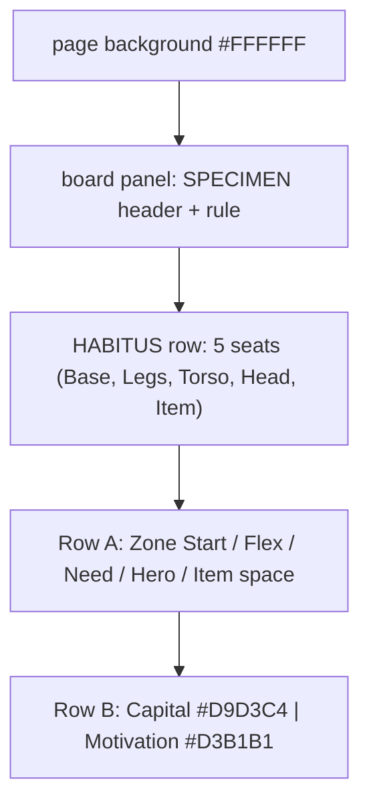

---

# Standing strip (both faces, one page)

Source: `../standing-281x34mm-A4-landscape.svg`
Page: 333x210mm landscape · strip itself is 317x34mm (widened from 281 to match THE TEAM's
widened Standing slot)

The Standing row lives on a separate physical strip, not on THE TEAM board itself: cut both
panels, glue to opposite faces of one 2mm greyboard piece, seat it in THE TEAM board's dashed
slot with Face B showing, and flip in place at the start of week 4.

## Grouping

| `<g id>` | Contents | Background (hex) |
|---|---|---|
| header (ungrouped) | sheet title banner + rule | - |
| `face-a` | "FACE A · THE ROW": Standing band, 6-circle track + numbered scale, flip-ring, footnote, "Authorized Voice" + description + citation | `#D9D3C4` |
| `face-b` | "FACE B · UNTIL WEEK 4": turn-over instruction, "Standing joins the Ledger" headline, description with tinted term chip, all-caps reminder line | none (plain `.r` outline) |
| cut instructions (ungrouped) | dashed cut line + 2 lines of glue/assembly instructions | - |

## Text

| Text | Class / font | Size | Colour | Background chip (hex) |
|---|---|---|---|---|
| "STANDING · BOTH FACES ON THIS PAGE · PRINT AT 100%" | `.m` mono | 3.2 | `#000000` | - |
| "FACE A · THE ROW" | `.m` mono | 4.2 | `#000000` | - |
| "this is the side you turn up at the start of week 4" | `.s` italic serif | 3.6 | `#000000` | - |
| "Standing" | `.s` serif | 6 | `#000000` | - |
| "grown by nobody" | `.s` italic serif | 3.4 | `#000000` | - |
| scale labels 0-5 | `.m` mono | 3.8 | `#000000` | - |
| "NOT GROWN - IT MIRRORS THE HIGHEST CAPITAL AT THE TABLE" | `.m` mono | 2.8 | `#000000` | `#D9D3C4` chip behind "Capital" |
| "Authorized Voice" | `.s` serif | 5 | `#000000` | - |
| "Once a week: cancel an / Event outright." | `.s` italic serif | 3.4 | `#000000` | - |
| "BOURDIEU 1991" | `.m.q` mono | 2.6 | `#000000` | - |
| "FACE B · UNTIL WEEK 4" | `.m` mono | 4.2 | `#000000` | - |
| "this is the side showing while the strip sits in its slot" | `.s` italic serif | 3.6 | `#000000` | - |
| "TURN ME OVER · START OF WEEK 4" | `.m.q` mono | 3.6 | `#000000` | - |
| "Standing joins the Ledger." | `.s` serif | 9 | `#000000` | - |
| "It is not grown. It mirrors the highest Capital..." | `.s` serif | 4.6 | `#000000` | `#D9D3C4` chip behind "Capital" |
| "ALSO NOW: A FACE-DOWN QUALITY CHIP GOES ON EACH FEATURE" | `.m` mono | 3.2 | `#000000` | - |
| Cut/glue instructions (2 lines) | `.s` serif (bold spans) | 4 | `#000000` | - |

## Illustration

Face A and Face B are each drawn inside their own `<g transform="translate(...)">` so their
**local** coordinates match Standing-slot geometry exactly (six circle centres at
x = 96,116,136,156,176,196, matching the wells this strip must line up with when seated). Paint
order per face: panel fill + border, title, subtitle, scale number labels, then the 6 outline
circles, then the red flip-ring (`stroke:#905151;stroke-width:.8`) over the 6th circle, then a
footnote bracket path, then the description/citation on the right. The cut line uses the
`.cut` dashed class (`#4A5259`, `stroke-dasharray:3 2`) to visually distinguish "cut here" from
every other dashed use (`.slot`/`.seat`/`.hab`, all `#2A2620`).

## Layout diagram

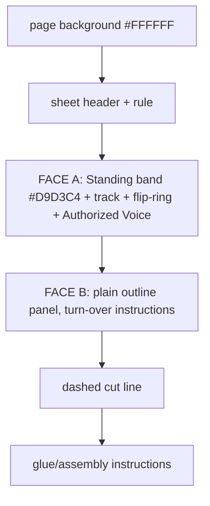

---

# THE DEVELOPMENT (the Zone, week 3 payoff, both faces, one page)

Source: `../the-development-127x104mm-A4-landscape.svg`
Page: 297x210mm landscape · panel itself is 127x104mm

Split off THE ZONE on purpose: Learn/Teach and the Ledger's Capability/Shared Practice payoff
don't exist before week 3. Sits face-down beside THE ZONE until week 3, then turns over - same
week the Specimen panel on each person board starts being read.

## Grouping

| `<g id>` | Contents | Background (hex) |
|---|---|---|
| header (ungrouped) | sheet title banner + rule | - |
| `board-4b-front` | "HOW YOU COVER" panel (LEARN/TEACH rules + ZPD note) + "THE LEDGER READS THIS" panel (Capability full-line rule, Shared Practice stack rule, 3-line citation block) | Capability strip `#C7CFB5`; Shared Practice strip `#FAECBE` |
| `board-4b-back` | "THE PAYOFF/ TURN ME OVER START OF WEEK 3" + 3-line teaser paragraph | none, plain `.r` outline |
| cut instructions (ungrouped) | dashed cut line + 3 lines of glue/assembly instructions | - |

## Text

| Text | Class / font | Size | Colour | Background chip (hex) |
|---|---|---|---|---|
| "BOARD 4b · THE ZONE, CONTINUED · BOTH FACES ON THIS PAGE · PRINT AT 100%" | `.m` mono | 3.2 | `#000000` | - |
| "FRONT · THE PAYOFF" | `.m` mono | 3.2 | `#000000` | - |
| "HOW YOU COVER" | `.m` mono | 5 | `#000000` | - |
| "LEARN" / rule text | `.m` mono / `.s` serif | 3.4 | `#000000` | - |
| "TEACH" / rule text | `.m` mono / `.s` serif | 3.4 | `#000000` | - |
| ZPD footnote (Vygotsky) | `.s.q` italic serif | 2.5 | `#000000` | - |
| "THE LEDGER READS THIS" | `.m` mono | 4.6 | `#000000` | - |
| "CAPABILITY · A FULL LINE" | `.m` mono | 3.4 | `#000000` | strip `#C7CFB5` |
| "fill any whole row or whole column → +1 Capability" | `.s` serif | 3.2 | `#000000` | - |
| "SHARED PRACTICE · A STACK" | `.m` mono | 3.4 | `#000000` | strip `#FAECBE` |
| "two of you covering the same square → +½ Shared Practice" | `.s` serif | 3.2 | `#000000` | - |
| 3-line citation block (Bourdieu/Vygotsky/Marx) | `.m.q` mono | 2.5 | `#000000` | - |
| "BACK · UNTIL WEEK 3" | `.m` mono | 3.2 | `#000000` | - |
| "TURN ME OVER" / "START OF WEEK 3" | `.m.q` mono | 4.2 / 3.4 | `#000000` | - |
| "The Zone has more to it than the grid." + 2 detail lines | `.s` serif | 4.6 / 3.4 | `#000000` | - |
| cut/glue instructions (3 lines) | `.s` serif (bold spans) | 4 | `#000000` | - |

## Illustration

Front and back panels are each `<g transform="translate(0,N)">` wrappers so both sit on one A4
sheet with a shared cut line between them. The "THE LEDGER READS THIS" panel draws its two
category strips as **filled rects first** (`#C7CFB5`, `#FAECBE`, both `rx 1.5`), then the label
+ body text on top - the same pattern as THE TEAM's row bands, deliberately, since this panel
is restating what the Ledger will do with what's covered here. The cut line uses `.cut`
(`#4A5259`, dashed `3 2`), distinct from every content-area dashed use.

## Layout diagram

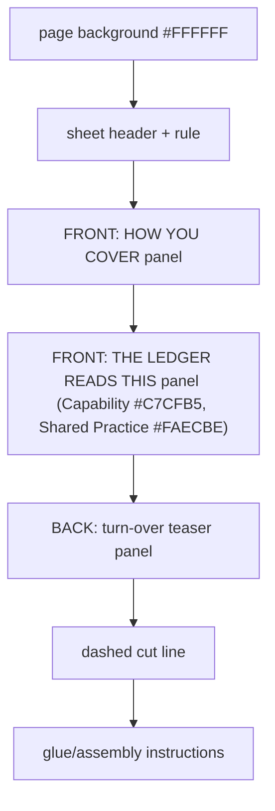

---

# THE PROJECT (A3 landscape)

## Sheets

| Face | Source SVG | Page |
|---|---|---|
| FRONT | `../the-project-FRONT-A3-landscape.svg` | 420x297mm landscape (true A3) |
| BACK | `../the-project-BACK-A3-landscape.svg` | 420x297mm landscape (true A3) |

Glued front-to-back onto one piece of cardboard, same paper size and orientation so the pair
flips about the long edge without mirroring. BACK is what the table sees before the game
starts (Week 1's reveal); FRONT is Week 1's live board: THE CLOCK (deadline ladder), the tower
plinth, the Project card seat, six Features, and THE WEEK's six card slots (five weekdays +
Overtime). Card slots are 65x90mm to hold a 63x88mm card. White ground, line art only.

## FRONT

### Grouping

| Logical group / `<g id>` | Contents | Background (hex) |
|---|---|---|
| page background | full-page rect | `#FFFFFF` |
| header | "THE PROJECT" title + "THE PROJECT · WEEK 1" + rule line | - |
| THE CLOCK | label, 2-line italic note, 8 stacked week-countdown boxes (7 WEEKS LEFT ... DEADLINE) | - |
| tower plinth | hexagon polygon + "PLINTH" label | - |
| project card seat | 90x90 dashed slot + "PROJECT CARD" label | - |
| `feature-A` .. `feature-F` | one row each: letter, complexity diamond, complexity text, Work-cost circles, cost badge, unlock/gate note | A/E: none; B/C: none; D/F rows use red-tinted border `#905151` |
| THE WEEK | section rule + "THE WEEK" title | - |
| week slots | 6 dashed card slots (Mon-Fri + Overtime), Overtime outlined in `#905151` | - |
| Overtime sidebar | Get the project done faster - We're sure its not going to bite you in the ass later! | `#D3B1B1` chip behind "COSTS 1 MOTIVATION" |
| table-placement guide | 3 coloured edge lines | - |

### Text

| Text | Class / font | Size | Colour | Background chip (hex) |
|---|---|---|---|---|
| "THE PROJECT" | `.m` mono | 7 | `#000000` | - |
| "THE PROJECT · WEEK 1" | `.m.q` mono | 3.8 | `#000000` | - |
| "THE CLOCK" | `.m` mono | 6 | `#000000` | - |
| "Counts down to the deadline - whatever isn't banked doesn't count." | `.s` italic serif | 3.4 | `#000000` | - |
| "7 WEEKS LEFT" ... "DEADLINE" (8 boxes) | `.m` mono | 3.4 | `#000000` | boxes are `.w` outline only; DEADLINE box outlined `#905151` |
| "PLINTH" / "stack banked / features here" | `.m q` / `.s` italic | 4.4 / 3.8 | `#000000` | - |
| "PROJECT CARD" / "names the six features" | `.m q` / `.s` italic | 5 / 4 | `#000000` | - |
| "FEATURES" / "COMPLEXITY" (column headers) | `.m` mono | 4 / 3.6 | `#000000` | - |
| Feature letter (A-F) | `.m` mono | 9 | `#000000` | - |
| Complexity word (LOW/MEDIUM/HIGH · gate) | `.m` or `.m.q` mono | 3.8 | `#000000` (red border on gated rows) | - |
| Complexity aside ("Plan is wasted here", etc.) | `.s` italic serif | 3.8 | `#000000` | - |
| Work-cost number (in dark circle) | `.m` mono | 5.5 | `#F2EDE0` on `#5C4830` circle | - |
| "UNLOCKS D" / "UNLOCKS F" | `.m` mono | 5 | `#000000` | - |
| "THE WEEK" | `.m` mono | 7 | `#000000` | - |
| Weekday labels (MONDAY...OVERTIME) | `.m` mono | 4.4 | `#000000` | - |
| "ORDER DOES NOT MATTER" | `.m.q` mono | 5.5 | `#000000` | - |
| Overtime sidebar notes (incl. italic joke aside, "we're sure it's not going to bite you in the ass later!") | `.m`/`.m.q`/`.s` mono/serif | 2.8-3 | `#000000` | `#D3B1B1` behind "COSTS 1 MOTIVATION" |

### Illustration

**Feature rows (A-F):** each is a `<g id="feature-X">` painted in this order - row border
rect, letter, complexity diamond (dashed outline polygon), complexity label + aside, 1-3
translucent "capacity" circles (`fill:#8B6F47;fill-opacity:.35`), the Work-cost circle (solid
`#5C4830`) with its number on top, and an optional "UNLOCKS" label. Rows D and F use a
heavier red-tinted border (`#905151`, stroke-width .8) to mark them as gated/blocked; their
complexity label drops the `.q` fill so it reads plain black instead of grey.

**THE CLOCK** is 8 stacked `.w`-outlined boxes (52x9mm, rx 1.2) top to bottom counting 7 to 1
weeks left, then DEADLINE with a red-tinted outline.

**The plinth** is a flattened hexagon (`polygon`) with a 3-line label centred inside it.

**The project seat** is a dashed 90x90 rect (`.slot` class) - deliberately wider than the
65x90 weekday slots because the Project card (88x88) never shuffles with the other decks.

**Paint order overall:** page background -> header -> THE CLOCK -> plinth -> project seat ->
FEATURES header -> feature-A through feature-F (top to bottom) -> THE WEEK rule
-> six week slots -> Overtime sidebar notes -> table-placement guide (always last).

### Layout diagram

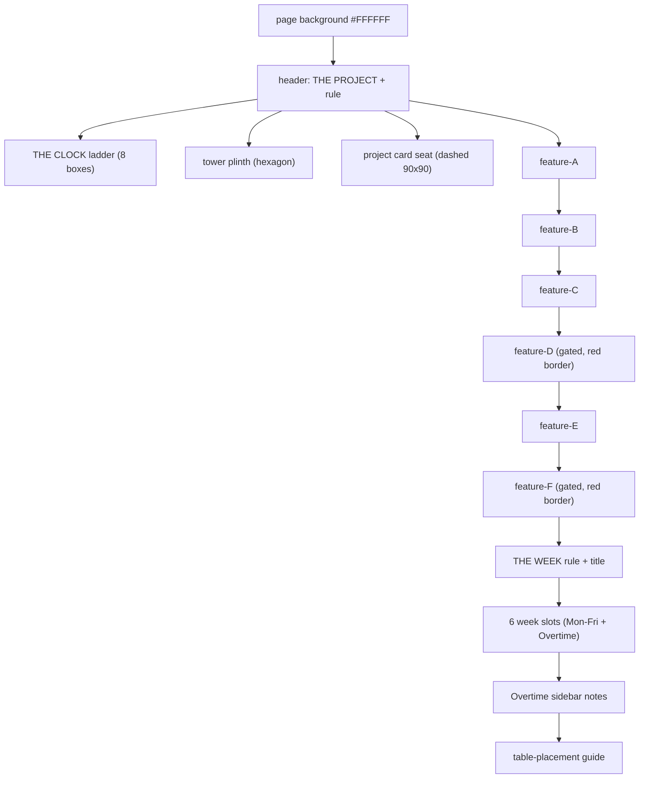

## BACK

This sheet has no named `<g id>` groups - every element is placed directly on the page in
document order. Treat these as the logical groups for editing purposes.

### Grouping

| Logical group | Contents | Background (hex) |
|---|---|---|
| page background | full-page rect | `#FFFFFF` |
| header | "Turn me over after setup" | - |
| week title | "WEEK 1" + "THE PROJECT" + heavy rule | - |
| the one idea | section label + big one-line pitch | - |
| on the table | section label, two lines of body text, one highlighted term | `#D3B1B1` chip behind "Motivation" |
| cards in play | section label + card list | - |
| card stacks | "SET OUT THESE STACKS" label + 2 dashed placeholders (PROJECT CARDS 90x90mm, ACTION CARDS 65x90mm) with italic captions | dashed `.h` outline only |
| table-placement guide | 3 coloured edge lines (teal, ochre, brown) | - |

### Text

| Text | Class / font | Size | Colour | Background chip (hex) |
|---|---|---|---|---|
| "TURN ME OVER AFTER SETUP" | `.m.q` mono | 6 | `#000000` | - |
| "WEEK 1" | `.m` mono | 26 | `#000000` | - |
| "THE PROJECT" | `.s` serif | 42 | `#000000` | - |
| "THE ONE IDEA" | `.m.q` mono | 6 | `#000000` | - |
| "A week is five days, and you choose them." | `.s` serif | 20 | `#000000` | - |
| "ON THE TABLE" | `.m.q` mono | 6 | `#000000` | - |
| "The week strip and the six features." | `.s` serif | 8 | `#000000` | - |
| "Your figure, your Knowledge, your Motivation." | `.s` serif | 8 | `#000000` | `#D3B1B1` behind "Motivation" |
| "Nothing else yet." | `.s` serif | 8 | `#000000` | - |
| "CARDS IN PLAY" | `.m.q` mono | 6 | `#000000` | - |
| "PLAN · WORK · COORDINATE · CELEBRATE" | `.m` mono | 7 | `#000000` | - |
| "SET OUT THESE STACKS" | `.m.q` mono | 6 | `#000000` | - |
| "PROJECT CARDS" / "pick one at setup, the rest wait here" | `.m q` / `.s q` italic | 5 / 3.6 | `#000000` | - |
| "ACTION CARDS" / "this week's four cards, the rest wait for later" | `.m q` / `.s q` italic | 5 / 3.6 | `#000000` | - |

### Illustration

Two rule lines split the page: a heavy one under the WEEK 1/THE PROJECT title block (`stroke-width
1.2`), a light one under THE ONE IDEA (`stroke-width .5`, compressed to y=172 so the lower row has
room for true-size card boxes), both class `.h` (`#2A2620`). A vertical light divider
(`stroke-width .4`) at x=212, y=180-290, splits ON THE TABLE/CARDS IN PLAY (left) from the
card-stack column (right). One highlighted term ("Motivation") gets a small rounded-rect chip
(`rx 1.4`, fill `#D3B1B1`) drawn **before** its text so the text sits on top. **Card stacks:**
two dashed placeholders (`class="h"`, `stroke-width .5`, `stroke-dasharray "3 2"`) sized to the
same true drop-in tolerance used elsewhere in this game (card size + 2mm each dimension) -
PROJECT CARDS at x=228 y=200 width=90 height=90 (holds the 88x88mm Project card), ACTION CARDS
at x=328 y=200 width=65 height=90 (holds a 63x88mm Activity/Event card), a 10mm gap between them,
both bottoms at y=290 (2mm inside the pageHeight-5=292 safe margin). These replace what used to
be a "HOW A WEEK RUNS" mechanics recap - that content was fully duplicate of FRONT's THE WEEK
section and the leaflet, so it was dropped to make room for showing players where to physically
stage the decks before Week 1 starts. Each placeholder carries a mono label near the top
(y=box_top+14) and a 2-line italic caption near the bottom (y=box_top+76 / +81). The
table-placement guide is three plain coloured lines in the bottom-left/right corners (`#3F5B66`,
`#9C7A32`, `#6E6249`, each `stroke-width 1`) - these must match the colour of the touching edge on
whichever board sits next to this one on the table; do not recolour one side without its neighbour.

### Layout diagram

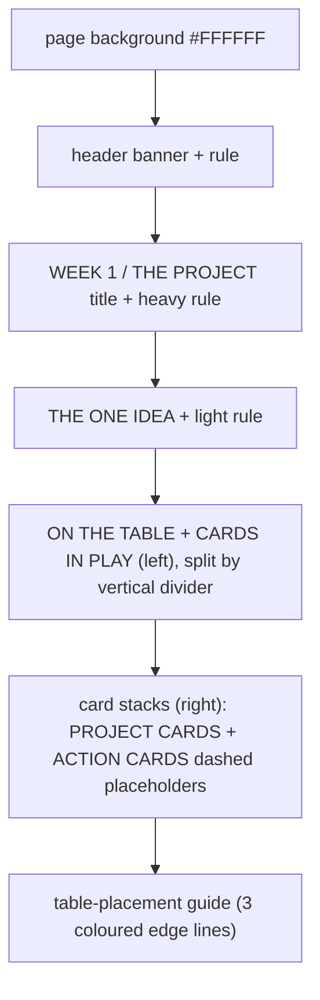

---

# THE TEAM (A4 landscape)

## Sheets

| Face | Source SVG | Page |
|---|---|---|
| FRONT | `../the-team-FRONT-A4-landscape.svg` | 297x210mm landscape (true A4) |
| BACK | `../the-team-BACK-A4-landscape.svg` | 297x210mm landscape (true A4) |

FRONT is the master colour source for the whole game - see the colour canon in
`board-game-boards` and `board-game-cards`. One coin per row; walk it as the track moves; at
the ring, turn it over - that's a permanent **HABIT**. The Standing row is dashed/covered until
week 4. BACK is Week 1's reveal, glued to the reverse.

## FRONT

### Grouping

| `<g id>` | Contents | Background (hex) |
|---|---|---|
| header (ungrouped) | "THE TEAM" title, italic tagline, "THE TEAM · FROM END OF WEEK 1", rule, legend box + 2-line legend, "START" (over circle 1) / "FLIP → HABIT" (over circle 4) / "HABIT and who named it" | legend box: `.r` outline only |
| `trust` | title, subtitle, 6-circle coin track numbered 0-5, red flip-ring at circle 4, 'TEACH DOES NOTHING' footnote under circles 0-1, "Psychological Safety" + citation | `#D3CEDF` |
| `capability` | title, subtitle, 6-circle track numbered 0-5, flip-ring, 'FIRST WORK DOES NOTHING' footnote under circles 0-1, "Who Knows What" + citation | `#C7CFB5` |
| `shared-practice` | title, subtitle, 6-circle track numbered 0-5, flip-ring, 'PLAN DOES NOTHING' footnote under circles 0-1, "Shared Repertoire" + citation | `#F7D7A1` |
| `adaptability` | title, subtitle, 6-circle track, flip-ring, single wide footnote spanning both halves, "Team Reflexivity" + citation | `#B5C7CF` |
| `standing-slot` | title, subtitle, "STANDING GOES HERE, FACE DOWN" + turn-over instruction | `#F5CE89`, dashed border |

Row tint follows the same People/Environment/Management/Customer categories the Event-card
tints derive from: Trust = People, Capability = Environment, Shared Practice = Management,
Adaptability = Customer - see the colour canon in `board-game-boards`/`board-game-cards`.

### Text

| Text | Class / font | Size | Colour | Background chip (hex) |
|---|---|---|---|---|
| "THE TEAM" | `.m` mono | 7 | `#000000` | - |
| "It was never only the project." | `.s` italic serif | 4.4 | `#000000` | - |
| "THE TEAM · FROM END OF WEEK 1" | `.m.q` mono | 3.8 | `#000000` | - |
| Legend 2 lines (One coin per row...) | `.s` italic serif | 3.8 | `#000000` | - |
| "START" | `.m` mono | 4.2 | `#000000` | - |
| "FLIP → HABIT" | `.m` mono | 4.2 | `#000000` | - |
| "HABIT - PRINTED ON THE EVENT CARDS" | `.m` mono | 3 | `#000000` | - |
| Row title (Trust/Capability/Shared Practice/Adaptability) | `.s` serif | 6 | `#000000` | - |
| Row subtitle ("grown by ...") | `.s` italic serif | 3.4 | `#000000` | - |
| Track numbers 0-5 (inside each of the 6 circles, all four rows) | `.m q` mono | 4.2 | `#000000` | - |
| Row footnote caption under circles 0-1 (e.g. "TEACH DOES NOTHING", "FIRST WORK DOES NOTHING", "PLAN DOES NOTHING") | `.m` mono | 2.6-2.8 | `#000000` | - |
| Row habit name (e.g. "Psychological Safety") | `.s` serif | 5 | `#000000` | - |
| Row citation (e.g. "EDMONDSON 1999") | `.m.q` mono | 2.6 | `#000000` | - |
| "Standing" | `.s` serif | 6 | `#000000` | - |
| "the fifth row, on its own strip" | `.s` italic serif | 3.4 | `#000000` | - |
| "STANDING GOES HERE, FACE DOWN" | `.m` mono | 4.4 | `#000000` | - |
| "TURN IT OVER IN PLACE AT THE START OF WEEK 4" | `.m.q` mono | 3.2 | `#000000` | - |

### Illustration

Each Ledger row is a `<g id="...">` with a small vertical `translate` offset (rows drift -4,
-3, -2, -1 respectively - a leftover of an old layout pass; preserve unless resequencing).
Paint order **inside each row**: tinted band rect, title, subtitle, then the 6 outline circles
(`.w`, r=8, centres at x = 86, 103.7, 121.5, 139.2, 156.9, 174.7), then a 0-5 track number
centred inside each circle (`.m q` mono, 4.2), then a red-outlined **flip ring** (r=10.5,
`stroke:#905151;stroke-width:.8`) drawn on top of circle 4 to mark where a coin turns over,
then **one** footnote bracket under circles 0-1 with a centred mono caption, then the Habit
name + citation on the right side of the row. Trust, Capability and Shared Practice each used
to carry a **second** footnote bracket under circles 4-5 (the 'after the ring' state) -
removed, since a single footnote per row reads cleaner and Adaptability never had one to match.

**Row order top to bottom:** Trust (`#D3CEDF`) → Capability (`#C7CFB5`) → Shared Practice
(`#F7D7A1`) → Adaptability (`#B5C7CF`) → Standing slot (`#F5CE89`, dashed,
week-4 only). This top-to-bottom order **is** the colour canon other components derive from -
do not reorder rows without updating every card/board that reads it.

### Layout diagram

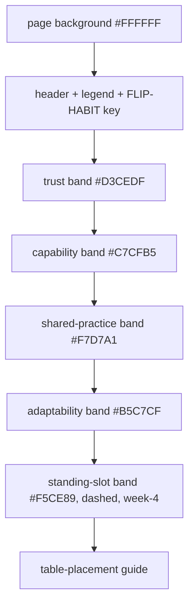

## BACK

Content authored at 471x297 inside `<g transform="scale(0.70700636943)">` to fit true A4
landscape.

### Grouping

| Logical group | Contents | Background (hex) |
|---|---|---|
| page background | full-page rect (inside scale wrapper) | `#FFFFFF` |
| header | "TURN ME OVER AT THE END OF WEEK 1" + rule | - |
| week title | "End of week 1" + "THE TEAM" + heavy rule | - |
| the one idea / cards added | label + pitch line; second label + card list, same row | - |
| what opens (left column) | label + 3-line paragraph on the Ledger | - |
| catch up before you play (right column) | label + 2 short paragraphs, separated from left by a vertical divider | - |
| footer aside | italic closing line | - |
| table-placement guide | 3 coloured edge lines (`#6E7A54`, `#9C7A32`, `#905151`) | - |

### Text

| Text | Class / font | Size | Colour | Background chip (hex) |
|---|---|---|---|---|
| "TURN ME OVER AT THE END OF WEEK 1" | `.m.q` mono | 6 | `#000000` | - |
| "END OF WEEK 1" | `.m` mono | 26 | `#000000` | - |
| "The team" | `.s` serif | 42 | `#000000` | - |
| "THE ONE IDEA" | `.m.q` mono | 6 | `#000000` | - |
| "It was never only the project." | `.s` serif | 20 | `#000000` | - |
| "CARDS ADDED" | `.m.q` mono | 6 | `#000000` | - |
| "LEARN · ALIGN · REFLECT · MEET" | `.m` mono | 9 | `#000000` | - |
| "WHAT OPENS" | `.m.q` mono | 6 | `#000000` | - |
| "The Ledger: Trust, Capability, Shared Practice, Adaptability..." (3 lines) | `.s` serif | 8 | `#000000` | - |
| "Adapt is now your full Adaptability, not 1." | `.s` serif | 8 | `#000000` | - |
| "CATCH UP BEFORE YOU PLAY" | `.m` mono | 6 | `#000000` | - |
| "Move Trust up 1 for every two Coordinate cards..." (2 lines) | `.s` serif | 8 | `#000000` | - |
| "Everything else starts where it always was, at 2..." (2 lines) | `.s` serif | 8 | `#000000` | - |
| "It was counting all along." | `.s` italic serif | 9 | `#000000` | - |

### Illustration

Same scale-wrapper pattern as SHIT HAPPENS BACK: **all coordinates are in the pre-scale 471x297
space; never edit the outer page-space numbers directly.** A vertical `.h` divider
(`stroke-width .4`) at x=237.1 splits WHAT OPENS (left) from CATCH UP BEFORE YOU PLAY (right).
Two `.h` rules mark section breaks (`stroke-width 1.2` under the title, `.5` under THE ONE
IDEA). The table-placement guide has **three** segments here (unlike SHIT HAPPENS's two),
because this board's reverse touches three different neighbours along its edges.

### Layout diagram

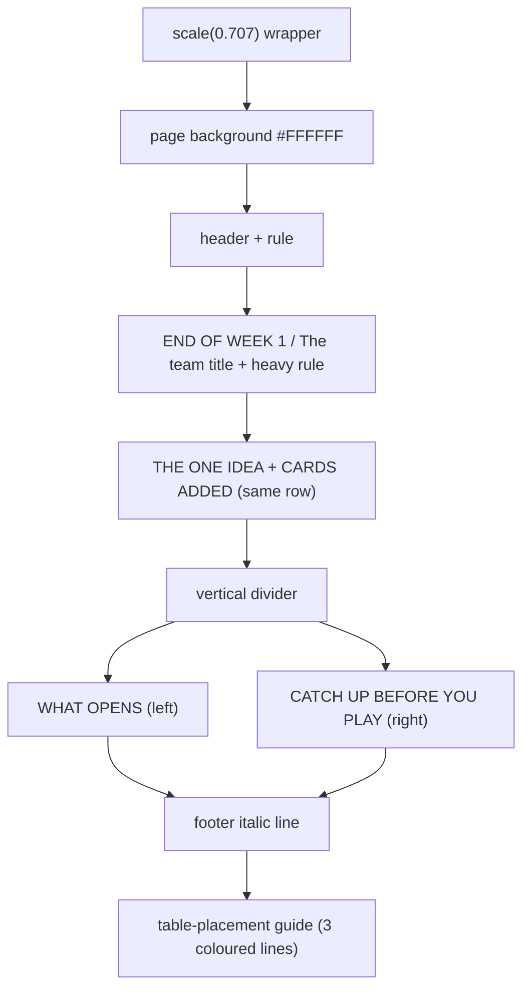

---

# THE ZONE (A4 landscape)

## Sheets

| Face | Source SVG | Page |
|---|---|---|
| FRONT | `../the-zone-FRONT-A4-landscape.svg` | 297x210mm landscape (true A4) |
| BACK | `../the-zone-BACK-A4-landscape.svg` | 297x210mm landscape (true A4) |

One shared board for the whole table: rows = education (Legs), columns = skill (Item), a square
= the practice that training makes with that instrument. 20mm squares, one player tile per
square. FRONT is week-1 content only - Learn/Teach payoff lives on THE DEVELOPMENT from week 3.
Unlike THE PROJECT, SHIT HAPPENS and THE TEAM, THE ZONE never flips during play - BACK exists
only so the board glues to cardboard like the others and can carry the table-placement guide;
it is never meant to be read at the table.

## FRONT

### Grouping

| `<g id>` (in `<defs>`) | Contents | Background (hex) |
|---|---|---|
| `sh-legs` | triangle icon glyph (Legs row shape) | fill `#F2EDE0` (`.ic`) |
| `sh-item` | diamond icon glyph (Item column shape) | fill `#F2EDE0` (`.ic`) |
| `p1`-`p5` | pip-count glyphs (1-5 dots), used inside the shape icons | fill `#2A2620` (`.pip`) |
| header (ungrouped) | "THE ZONE" title, italic subtitle, "THE ZONE · SHARED..." note, rule | - |
| column headers | skill names (LAPTOP...CALENDAR) + "SKILL" label + 5 Item-diamond icons with pip counts | - |
| row headers | "EDUCATION" (rotated -90°), 5 Legs-triangle icons with pip counts, row names | - |
| the 5x5 grid | 25 cells (`.cell` class), practice-name text per cell, thick outer border, DEMO/COORDINATE/ALIGN/LEARN/PLAN column-footer labels | cells: no fill, outline only |
| THE DEVELOPMENT placeholder | dashed 119x104 box + "THE DEVELOPMENT GOES HERE · FROM WEEK 3" + 2-line note + Shared Practice / 4-player caption | none, dashed `.r` border |
| footer | rule + "WHAT **LEARN** AND **TEACH** DO " label + 3 explanatory paragraphs + Bourdieu closing note | - |
| table-placement guide | 2 coloured edge lines (`#6E7A54`, `#3F5B66`) | - |

### Text

| Text | Class / font | Size | Colour | Background chip (hex) |
|---|---|---|---|---|
| "THE ZONE" | `.m` mono | 7 | `#000000` | - |
| "what you can reach from what you already have" | `.s` italic serif | 4.4 | `#000000` | - |
| "THE ZONE · FROM WEEK 1" | `.m.q` mono | 3.8 | `#000000` | - |
| Skill column names (LAPTOP, COFFEE CUP, CLIPBOARD, WRENCH, CALENDAR) | `.m.q` mono | 2.1 | `#4A5259` | - |
| "SKILL" | `.m.q` mono | 2.8 | `#4A5259` | - |
| "EDUCATION" (rotated) | `.m.q` mono | 2.8 | `#4A5259` | - |
| Row names (Technical, Social, Commercial, Analytical, Organisational) | `.s` serif | 3.4 | `#000000` | - |
| Cell practice names (Build, Toolbox talk, Spec, ... Plan) | `.s` serif | 3 | `#000000` | - |
| Column footer labels (WORK, COORDINATE, ALIGN, LEARN, PLAN) | `.m.q` mono | 3.4 | `#4A5259` | - |
| "A fully covered column is an ACTION the whole team is better at." | `.s.q` italic serif | 3.4 | `#4A5259` | - |
| "Give one team member one extra Motivation if the ACTION card is played (maximum 1 per column)." | `.s.q` italic serif | 3.4 | `#4A5259` | - |
| "THE DEVELOPMENT GOES HERE · FROM WEEK 3" | `.m.q` mono | 3.2 | `#4A5259` | - |
| THE DEVELOPMENT placeholder 2-line note | `.s.q` italic serif | 3.4 | `#4A5259` | - |
| "A fully covered row and column both contributes to **SHARED PRACTICE** on THE TEAM." | `.s.q` italic serif | 3 | `#4A5259` | - |
| "If you are 4 team mates, pretend the empty row doesn't exist." | `.s.q` italic serif | 3 | `#4A5259` | - |
| "WHAT YOU CAN DO" | `.m` mono | 4.4 | `#000000` | - |
| 3 explanatory paragraphs | `.s` serif (mixed italic/normal spans) | 3.8-3.4 | `#000000` | - |
| Bourdieu closing note (embodied capital) | `.s` serif | 3 | `#000000` | - |

### Illustration

Icon glyphs are defined once in `<defs>` and reused via `<use>` at each row/column position,
scaled `.6`/`.72` as needed - **never redraw an icon inline**, always add a new pip-count `<g
id="pN">` if a new count is needed and reuse the existing shape defs. The whole grid+headers
block sits inside `<g transform="translate(-16,0)">` to recentre it under the header; keep any
new grid content inside that same wrapper. Paint order: 25 outline-only cells first, then one
thick-stroke (`stroke-width .8`) 100x100 border rect drawn **on top** of the cell grid to give
the whole 5x5 block a single strong outline without doubling every internal line. The Legs
triangle icons get a small nudge (`transform="translate(0,0.4)"`) applied to their pip glyphs
only, not the shape - this is a known correction, keep it if new icons are added to this row.
The THE DEVELOPMENT placeholder is a **dashed** outline rect (`stroke-dasharray "3 2"`),
distinguishing "content lives elsewhere, arriving later" from the solid-outline grid it sits
beside. The 2-line caption under the column-footer labels (y=150/155, 5mm apart) now has the
whole 13mm gap to itself and is no longer cramped - the Shared Practice / 4-player caption that
used to share that space moved down into THE DEVELOPMENT box's own generous free space
(y=105/109, well below its title and 2-line note, still well inside the box's y=36-140 bounds).

### Layout diagram

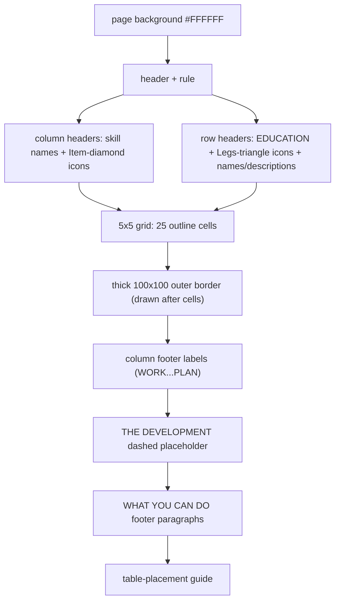

## BACK

### Grouping

| Logical group | Contents | Background (hex) |
|---|---|---|
| page background | full-page rect | `#FFFFFF` |
| header | "THIS SIDE NEVER SHOWS DURING PLAY" + rule | - |
| title block | "THE ZONE" + italic subtitle | - |
| why this face exists | label + 6-line explanatory paragraph | - |
| closing aside | italic single line ("If you are reading this...") | - |
| table-placement guide | 2 coloured edge lines (`#6E7A54`, `#3F5B66`) | - |

### Text

| Text | Class / font | Size | Colour | Background chip (hex) |
|---|---|---|---|---|
| "THIS SIDE NEVER SHOWS DURING PLAY" | `.m.q` mono | 5.4 | `#000000` | - |
| "THE ZONE" | `.m` mono | 20 | `#000000` | - |
| "Shared, and visible from week 1. It never turns over." | `.s` italic serif | 10 | `#000000` | - |
| "WHY THIS FACE EXISTS" | `.m.q` mono | 5 | `#000000` | - |
| 6-line explanatory paragraph | `.s` serif | 7 | `#000000` | - |
| "If you are reading this at the table, the Zone is face down." | `.s.q` italic serif | 6 | `#000000` | - |

### Illustration

Minimal: two `.h` rule lines (one under the banner, `stroke-width` default `.8`), no fills, no
circles, no icons - deliberately the plainest sheet in the set, since it is never meant to be
seen. The table-placement guide sits on two edges only (right edge + bottom edge), matching
whichever boards sit to the right and below it in the shared 630x507mm table layout. The
paragraph's first sentence used to run as one 103-character line at font 7 - it overflowed
well past the right edge (measured ~317mm of text against ~275mm of usable width) - so it's
now split into two lines ("...reveal a rule." / "THE ZONE has nothing to reveal -"), pushing
the remaining lines down 10mm each; the closing italic aside still clears the paragraph by 8mm.

### Layout diagram

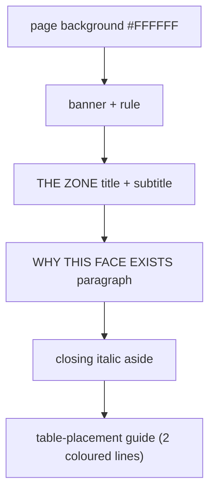

---

# SHIT HAPPENS (narrowed A4)

## Sheets

| Face | Source SVG | Page |
|---|---|---|
| FRONT | `../shit-happens-FRONT-A4-portrait.svg` | 174x297mm portrait |
| BACK | `../shit-happens-BACK-A4-portrait.svg` | 174x297mm portrait |

Narrowed from true A4 (210mm) so the table's two rows keep matching widths now that THE TEAM
is true A4 landscape (420 (THE PROJECT) + 174 (SHIT HAPPENS) = 594mm = 297 + 297 (THE TEAM and
THE ZONE) - see `_check-table-layout.svg`). FRONT holds SHIT HAPPENS (2 Event draw slots),
ADAPT (the pool + the HERO lane) and CLOSE THE WEEK (4 numbered steps); only the two Event
slots are real card-sized (58mm), everything else is informational and resized to fit the
narrower page. BACK is Week 2's reveal, glued to the reverse.

## FRONT

### Grouping

| `<g id>` / logical group | Contents | Background (hex) |
|---|---|---|
| page background | full-page rect | `#FFFFFF` |
| header | "SHIT HAPPENS" title + "SHIT HAPPENS · FROM WEEK 2" + rule | - |
| SHIT HAPPENS box | red-bordered panel, instruction line, 2 landing-zone slots, resolved-vs-stacks note | box border `#905151`; slot fill `#905151` (card silhouette, white label text) |
| `pool` | ADAPTABILITY label + 6-circle track panel + 3 caption lines | `#B5C7CF` |
| `lane-1` | HERO lane: label, cost chip, dashed 44x36mm HERO-tile slot + shape glyph | `#E8D4B8` |
| CLOSE THE WEEK box | title, "TOP TO BOTTOM" note, rule, 4 numbered steps | - |
| table-placement guide | 2 coloured edge lines (`#905151`, `#6E6249`) | - |

### Text

| Text | Class / font | Size | Colour | Background chip (hex) |
|---|---|---|---|---|
| "SHIT HAPPENS" | `.m` mono | 7 | `#000000` | - |
| "SHIT HAPPENS · FROM WEEK 2" | `.m.q` mono | 3.6 | `#000000` | - |
| "Draw two Event cards, face up." | `.s` serif | 5 | `#000000` | - |
| "EVENT 1" / "EVENT 2" | `.m` mono | 5 | `#FFFFFF` | on `#905151` slot fill |
| "If you adapt, the card is resolved and discarded." | `.s` serif | 4 | `#000000` | - |
| "If not, the card stays and the SHIT stacks." | `.s` serif | 4 | `#000000` | - |
| "ADAPT" | `.m` mono | 7 | `#000000` | - |
| "Deal with both Events now..." | `.s` serif | 4.2 | `#000000` | - |
| "ADAPTABILITY" | `.m.q` mono | 3.4 | `#000000` | panel `#B5C7CF` |
| "Spend maximum the number of Adapt points..." (3 lines) | `.s` serif | 2.8 | `#000000` | - |
| "HERO · CANCELS IT" | `.m.q` mono | 3.4 | `#000000` | panel `#E8D4B8` |
| "Needs your Head, and 3+ Motivation." | `.s` serif | 2.8 | `#000000` | - |
| "CLOSE THE WEEK" | `.m` mono | 7 | `#000000` | - |
| "TOP TO BOTTOM" | `.m.q` mono | 3.6 | `#000000` | - |
| Step 1-4 headline + detail lines | `.s` serif (bold lead-in) | 5.4 / 4.4 | `#000000` | step 3 headline sits on `#D3B1B1` chip |
| "FROM WEEK 3: +1 BACK IF THEIR NEED WAS MET" | `.m.q` mono | 3.4 | `#000000` | - |

### Illustration

**SHIT HAPPENS box** border tinted `#905151` (heavier stroke, .9) to flag it as the "threat"
panel. The two Event slots are drawn as **solid** `#905151`-filled rounded rects (not just
dashed outlines like other card slots) with white label text centred on top - paint order is
slot fill, then label, so the fill never covers the text. The resolved-vs-stacks note sits
below the slots (y=123/127, font 4 - smaller than the box's other body text, since the full
sentence at 5pt didn't fit the ~6mm gap below the slots); the box grew 3mm (99→102mm tall) to
fit it, closing the old 4mm gap above ADAPT down to 1mm rather than pushing ADAPT or CLOSE THE
WEEK down (both already sit close to the page's bottom margin).

**`lane-1`'s HERO slot is now true-size.** It used to be a 20mm dashed circle - far smaller
than the physical HERO tile (44x36mm, `cards-need-hero-44x36mm-A4-landscape.svg`) that actually
gets placed there during play. It's now a dashed **44x36mm** rounded rect, centred in the lane
(x=99 y=163, matching the tile's own footprint plus no extra tolerance since it only needs to
show placement, not a drop-in fit), with the small red hexagon glyph centred inside it. Fitting
the true-size slot meant dropping the "Gives / +2 Capital to you / +1 Motivation to team mate /
Maximum once per game" lines - **not just "Gives"** - because that whole payout, plus the
Motivation threshold, is already printed verbatim on the physical HERO tile itself (see its own
spec: "NEEDS 3 MOTIVATION OR HIGHER", "+2 CAPITAL TO YOU, +1 MOTIVATION TO A TEAM MATE"), and
there wasn't room for both the correctly-sized slot and a second copy of the same text. The
"Needs your Head, and 3+ Motivation." cost line stays, since it's useful **before** a tile is
placed (deciding whether Hero is even worth going for), unlike the payout line which only
matters once you're already holding the tile and reading it directly.

**`pool` group:** a solid `#B5C7CF` panel first, then its `.w`-outline border, then 6
outline-only circles (2 rows of 3) for the Adaptability track, then the caption text.

**`lane-1` group:** solid `#E8D4B8` panel + border, then a dashed ring (`stroke-dasharray "2
1.5"`) with a small red diamond glyph centred inside it (`transform="translate(121,174)"`),
then a cost-chip rect, then the gain lines each with their own small tinted background chip
(`#D9D3C4` for Capital, `#D3B1B1` for Motivation) drawn before the text.

**CLOSE THE WEEK steps:** each step number sits in a small outline circle (`r=5`) to its left;
step headlines that reference a resource get a coloured background chip drawn first. Step 3's
"empty means they leave" line is followed by a small red pentagon-ish glyph and a mono caption
for the week-3 rule addition.

### Layout diagram

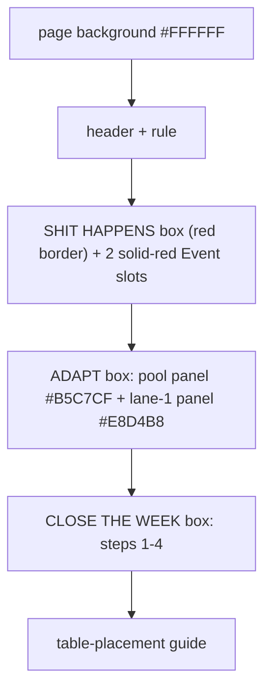

## BACK

Content is authored at 297x420 and wrapped in `<g transform="scale(0.70707070707)">` to fit the
narrowed 174mm page without re-authoring every coordinate.

### Grouping

| Logical group | Contents | Background (hex) |
|---|---|---|
| page background | full-page rect (inside the scale wrapper) | `#FFFFFF` |
| header | "TURN ME OVER AT THE START OF WEEK 2" + rule | - |
| week title | "WEEK 2" + "Reality" + heavy rule | - |
| the one idea | label + 2-line pitch ("Your plan was made / in ignorance."), compressed | - |
| event cards stack | "SET OUT THIS STACK" label + 1 dashed placeholder (EVENT CARDS, true 65x90mm drop-in) with italic caption | dashed `.h` outline only |
| footer aside | light rule + italic closing line | - |
| table-placement guide | 2 coloured edge lines (`#905151`, `#6E6249`) | - |

### Text

| Text | Class / font | Size | Colour | Background chip (hex) |
|---|---|---|---|---|
| "TURN ME OVER AT THE START OF WEEK 2" | `.m.q` mono | 6 | `#000000` | - |
| "WEEK 2" | `.m` mono | 26 | `#000000` | - |
| "Reality" | `.s` serif | 42 | `#000000` | - |
| "THE ONE IDEA" | `.m.q` mono | 6 | `#000000` | - |
| "Your plan was made" / "in ignorance." | `.s` serif | 20 | `#000000` | - |
| "SET OUT THIS STACK" | `.m.q` mono | 6 | `#000000` | - |
| "EVENT CARDS" | `.m q` mono | 7 | `#000000` | - |
| "draw two here every week," / "reshuffle when it runs out" | `.s q` italic serif | 5.1 | `#000000` | - |
| "Nothing changed except when you find out." | `.s` italic serif | 9 | `#000000` | - |

### Illustration

Everything sits inside one `<g transform="scale(0.70707070707)">` so the authored coordinate
space stays 297x420 regardless of the narrowed page - **never edit page-space coordinates
directly; edit inside the scale wrapper.** One `.h` rule under the title block (`stroke-width
1.2`), one lighter one under THE ONE IDEA (`stroke-width .5`, compressed to y=212 to free room
below), ending at x=230.36 (the scaled content width, not the raw 297). The table-placement guide
sits **outside** implicitly at the pre-scale coordinate frame's edges (x=11.15, spanning to
y=411.5) so it lines up with the FRONT face's own guide lines when both are printed at true size.

**Event cards stack:** the old "WHAT OPENS" (Shit Happens/Adapt/resolve walkthrough) and "CARDS
ADDED: NOTHING NEW" sections were fully duplicate of the FRONT's SHIT HAPPENS/ADAPT boxes and the
leaflet's PULSE step-list, so both were dropped to make room for a placeholder showing players
where to physically stage the Event deck. Because this face is authored in a pre-scale 297x420
space that gets shrunk by `scale(0.70707070707)` to fit the true 174mm page, a box's authored
width/height must be the TRUE mm size divided by 0.70707 (i.e. multiplied by ~1.4142) to print at
the correct true size - a true 65x90mm drop-in (63x88mm Event card + the same 2mm tolerance used
for every other card seat) needs authored `width=92 height=127`. Placed at x=81 y=244 (bottom
y=371, well inside the pre-scale bottom guide at y=411.5), roughly centred in the content column
(x=24-230). Dashed `.h` outline (`stroke-width .5`, `stroke-dasharray "3 2"`), mono label
"EVENT CARDS" near the top (y=264) and a 2-line italic caption near the bottom (y=349/357).

### Layout diagram

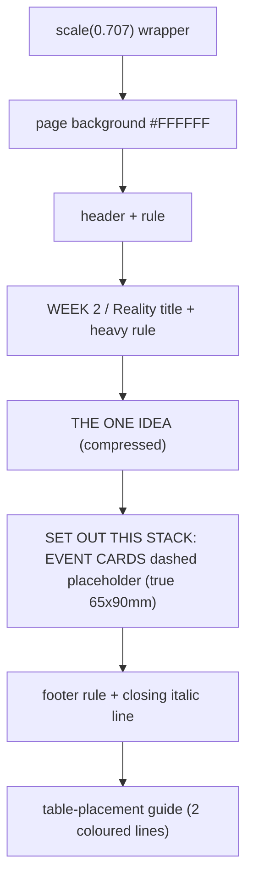
