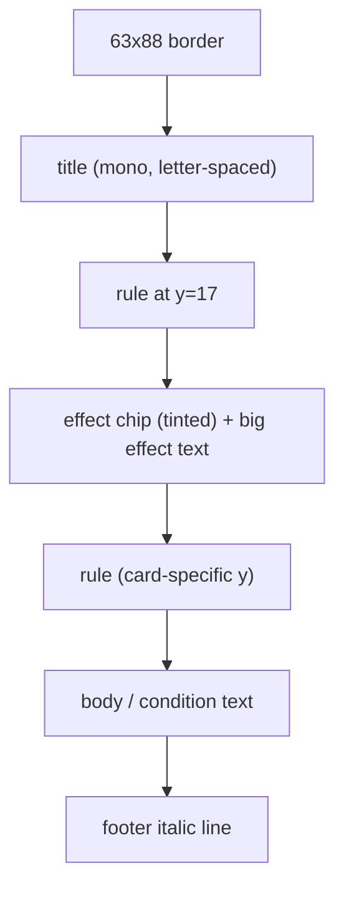
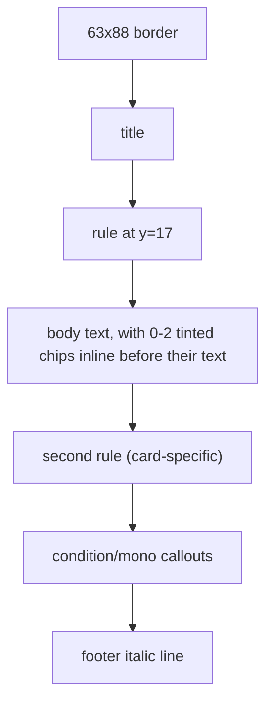
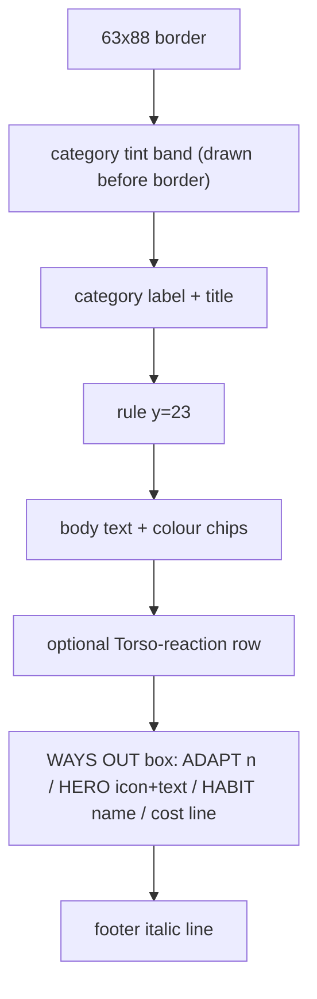
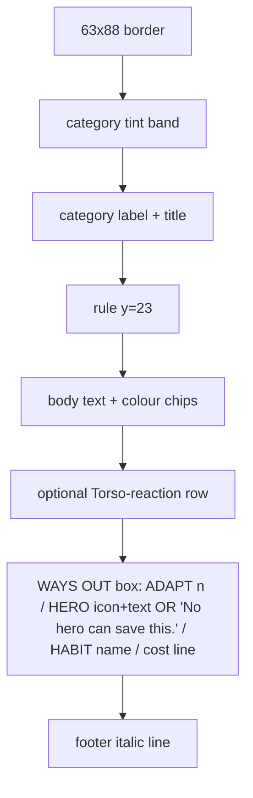
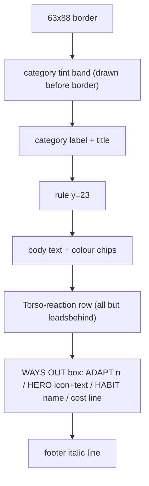
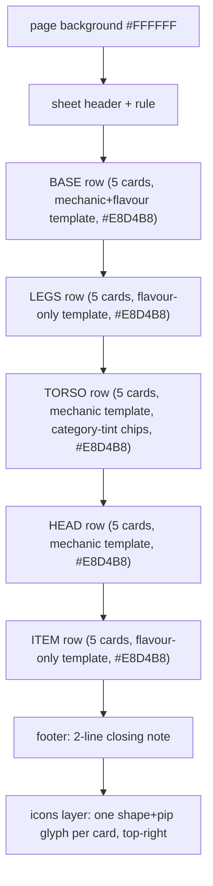
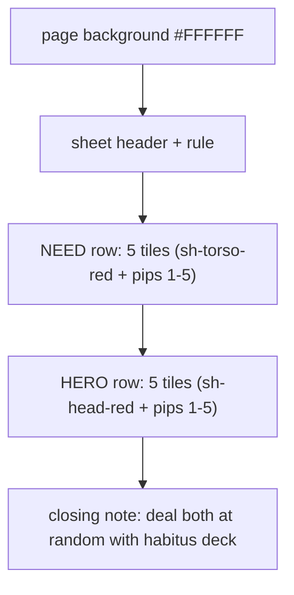
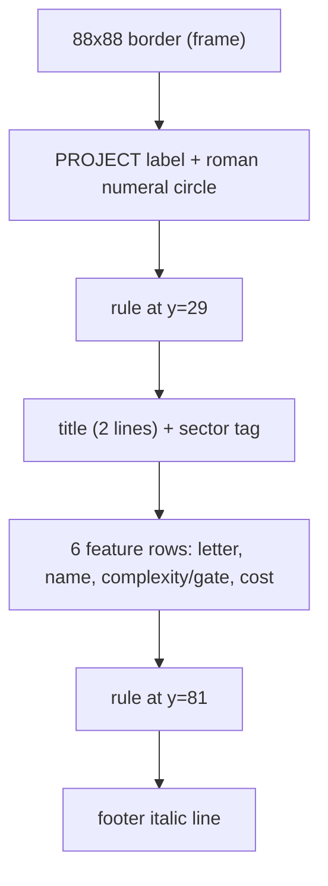

# Cards - all sheets, one spec

Consolidated Markdown spec for every card sheet in `game/components/`. This file replaces the
separate per-sheet spec files (`cards-activity.md`, `cards-event.md`,
`cards-habitus-parts-44x36mm-A4-portrait.md`, `cards-need-hero-44x36mm-A4-portrait.md`,
`cards-project-63x88mm-A4-portrait.md`), which are now redirect stubs pointing here. See the
[board-game-component-specs skill](../../../.github/skills/board-game-component-specs/SKILL.md)
for the editing workflow (md first, then SVG) and `board-game-cards` for the geometry canon
(WAYS OUT/HOW TO ADAPT anatomy, tint derivation, print margins) this file doesn't restate.

## Index

| Section | Source SVG(s) |
|---|---|
| [Activity cards](#activity-cards-63x88mm-a4) | `../cards-activity-63x88mm-A4-portrait.svg`, `../cards-activity-5b-63x88mm-A4-portrait.svg` |
| [Event cards](#event-cards-63x88mm-a4) | `../cards-event-01-09-63x88mm-A4-portrait.svg`, `../cards-event-10-18-63x88mm-A4-portrait.svg`, `../cards-event-19-21-63x88mm-A4-portrait.svg` |
| [Habitus part-cards](#habitus-part-cards-44x36mm-a4-landscape) | `../cards-habitus-parts-01-15-44x36mm-A4-landscape.svg`, `../cards-habitus-parts-16-25-44x36mm-A4-landscape.svg` |
| [NEED and HERO tiles](#need-and-hero-tiles-44x36mm-a4-landscape) | `../cards-need-hero-44x36mm-A4-landscape.svg` |
| [Project cards](#project-cards-88x88mm-a4) | `../cards-project-63x88mm-A4-portrait.svg` |

---

# Activity cards (63x88mm, A4)

## Sheets

| Sheet | Source SVG | Contains |
|---|---|---|
| 1 | `../cards-activity-63x88mm-A4-portrait.svg` | Work x3, Coordinate x2, Align x2, Celebrate x2 |
| 2 | `../cards-activity-5b-63x88mm-A4-portrait.svg` | Work x2 (five total with Sheet 1), Teach x2, Plan, Demo, Reflect, Meet, Learn |

Eighteen Activity cards, the week 1/3 core loop, split across two A4 sheets (nine per sheet,
each printed once - no reprinting). Card size 63x88mm, text column x=5..58 (53mm). All cards
share the same skeleton: `63x88` border rect (`.c`), title (mono, 6.6-7.5pt, letter-spacing
1.2-1.5), a `.h` rule at y=17, then the card's own body. No category tint band (that's an
Event-card feature, not Activity) - the **effect** itself gets the tinted rounded rect instead,
directly behind its headline number. Both sheets use the same `scale(.95238095,1)` outer-`<g>`
squeeze on every card def - a horizontal compensation kept from an earlier sheet layout so the
*drawn* card stays 63mm authored width while the printed result reads exactly 63x88 against the
board's 65x90 slot; do not remove without checking the printed card still fits.

## Sheet 1

### Grouping

| `<g id>` (in `<defs>`) | Header band | Header colour text class |
|---|---|---|
| `work` | `#EFE4D3` band behind "+1 to one feature" | plain `.q` |
| `coordinate` | `#D3CEDF` band behind "+1 Trust" | `.trust` |
| `align` | `#B5C7CF` band behind "+1 Adaptability instead" | `.adapt` |
| `celebrate` | `#D3B1B1` band behind "+2 Motivation to everyone" | plain |

### Text

| Card | Title | Big effect (in tinted chip) | Body / conditions | Footer italic |
|---|---|---|---|---|
| `work` | WORK | "+1 to one feature" (`#EFE4D3`) | "Adjust total Work for Capability and Shared Practice." | "The only card that moves the project. Hence the trap." |
| `coordinate` | COORDINATE | "+1 Trust" (`#D3CEDF`, 9pt) | "Trust ≤ 1: Teach is dead." + "TRACKS RISE 1 A WEEK, MAX" | "Safety is not declared. It is built, dully." |
| `align` | ALIGN | "+1 Adaptability instead" (`#B5C7CF`) | "Clear Unclear from one feature" / "Nothing Unclear? ..." + "ADAPTABILITY = CARDS YOU MAY RE-LAY AFTER EVENTS" | "Clear it the same week and the Work still counts." |
| `celebrate` | CELEBRATE | "+2 Motivation to everyone" (`#D3B1B1`, 6.6pt) | "+3 if a feature was banked this week." + "NO CELEBRATE: LOSE 1 MOTIVATION" (chip `#D3B1B1`) / "AT 0, A CHARACTER LEAVES" | "Nobody rests at work. You ship something and say so." |

Sheet placement (top-left corner of each `<use>`): Work at (10,12)/(76,12), Coordinate at
(142,12)/(10,104), Align at (76,104)/(142,104), Celebrate at (10,196)/(76,196), Work again at
(142,196).

### Illustration

Paint order per card: border, title, rule, effect chip (if any) then effect text, second rule,
body/condition text, footer italic - identical order across all four, which is what lets them
share one mental template.

### Layout diagram

## Sheet 2

### Grouping

| `<g id>` (in `<defs>`) | Header band(s) | Header colour text class |
|---|---|---|
| `work` | `#EFE4D3` behind "+1 to one feature" | plain |
| `teach` | none (plain body); `#D9D3C4` chip behind "EACH TEACHER GAINS +1 CAPITAL" | `.trust` on "DEAD IF TRUST ≤ 1" |
| `plan` | `#EFE4D3` behind "+1 EXTRA WORK" | plain |
| `demo` | `#D9D3C4` chip behind Med/High outcome; `#D9D3C4` chip behind Low outcome | plain |
| `reflect` | `#B5C7CF` behind "+1 Adaptability"; `#F7D7A1` behind "+1 Shared Practice" | `.adapt` |
| `meet` | `#D3CEDF` behind "+1 Trust"; `#B5C7CF` behind "+1 Adaptability" | `.trust` / `.adapt` |
| `learn` | `#D9D3C4` chip behind "NO CAPITAL FOR THIS ONE" | plain |

### Text

| Card | Title | Effect | Key conditions | Footer italic |
|---|---|---|---|---|
| `work` | WORK | "+1 to one feature" | "Adjust total Work for Capability and Shared Practice." | "The only card that moves the project. Hence the trap." |
| `teach` | TEACH | "Up to 2 characters may each teach 1 partner" | "square must touch one the partner covers - any row"; "DEAD IF TRUST ≤ 1"; "ONE CARD, ONE DAY - UP TO 2 PAIRS" | "Scaffolding: give it away and it becomes standing." |
| `plan` | PLAN | "+1 EXTRA WORK" (every Work card on that feature this week) | "HIGH COMPLEXITY: ALSO NEXT WEEK"; "NOT ON AN UNCLEAR FEATURE" | "Planning pays on hard problems. Only on those." |
| `demo` | DEMO | "Reveal a feature's Quality" | "CAPITAL ≥ TABLE AVERAGE"; Med/High → +1 Capital + shrug off review; Low → lose 1 Work, 1 Capital; "EITHER WAY, REMOVE UNCLEAR TOKEN" | "The field decides who speaks." |
| `reflect` | REFLECT | "+1 Adaptability" (+ "+1 Shared Practice" if a bank/Event happened since last Reflect) | "Ask what's not working - you can only reflect on it." |
| `meet` | MEET | "+1 Trust" + "+1 Adaptability" + clear one Unclear, OR "RECORD MEETING" (nothing, satisfies Event demands) | "WORKING MEETING" vs "RECORD MEETING" | "One of these is a meeting. The other is a ritual." |
| `learn` | LEARN | "Cover a free square in your own row" | "must touch a square you already cover"; "No teacher needed."; "COSTS THE DAY, NOTHING ELSE"; "NO CAPITAL FOR THIS ONE" | "Nobody taught you. It shows, and it holds." |

Sheet placement: Work (10,12), Work (76,12), Teach (142,12); Teach (10,104), Plan (76,104), Demo
(142,104); Reflect (10,196), Meet (76,196), Learn (142,196).

### Illustration

Same `scale(.95238095,1)` squeeze and shared skeleton as Sheet 1 (border, title, rule, body,
rule, footer). `demo` and `meet` are the only two cards on this sheet with **two** stacked
tinted chips instead of one, each drawn immediately before its own text line so the two chips
never merge visually. Paint order otherwise identical to Sheet 1's card template.

### Layout diagram

---

# Event cards (63x88mm, A4)

## Sheets

| Sheet | Source SVG | Contains |
|---|---|---|
| 1 | `../cards-event-01-09-63x88mm-A4-portrait.svg` | Events 1-9 |
| 2 | `../cards-event-10-18-63x88mm-A4-portrait.svg` | Events 10-18 |
| 3 | `../cards-event-19-21-63x88mm-A4-portrait.svg` | Events 19-23 (THE BIKESHED, LEADS FROM BEHIND, THE DASHBOARD, SHAKY GROUND, ALWAYS REACTING) - two rows on the sheet, rest blank |

Twenty-three "shit happens" cards, same size as Activity cards, split across three A4 sheets.
Draw two every week. See `board-game-cards` for the full WAYS OUT / HOW TO ADAPT anatomy and
tint-derivation rule every sheet follows. Icon defs (`i-base/i-legs/i-head/i-item/i-torso`,
`q1`-`q5`) are shared shapes but each sheet defines its own copy - they don't share `<defs>`
across files. Sheet 3 names an organisational-behaviour pattern from
[../../docs/theoretical-sources.md](../../docs/theoretical-sources.md) on each card without
ever printing the theorist's name, per the house rule; it uses only one row of three, the rest
of the page is intentionally blank (see `board-game-component-specs` for why a sheet doesn't
need to be filled to be valid).

## Sheet 1

### Grouping

| `<g id>` (in `<defs>`) | Category | Header tint (hex) |
|---|---|---|
| `status` | Management | `#F7D7A1` (`.cat-mgmt`) |
| `budget` | Management | `#F7D7A1` |
| `unclear` | Customer | `#B5C7CF` (`.cat-cust`) |
| `feedback` | Customer | `#B5C7CF` |
| `scope` | Customer | `#B5C7CF` |
| `priority` | Customer | `#B5C7CF` |
| `hoarding` | People | `#D3CEDF` (`.cat-ppl`) |
| `burnout` | People | `#D3CEDF` |
| `outage` | Environment | `#C7CFB5` (`.cat-env`) |

### Text

Every card follows: CATEGORY label -> title (1-2 lines) -> rule -> effect body (with 0-2 tinted
chips) -> optional Torso-reaction line (icon + pip + chip + mono caption) -> HOW TO ADAPT box
(ADAPT n, HERO icon+text, HABIT name, "SO IT COSTS n INSTEAD" or "SO IT NEVER HAPPENS") ->
footer italic line.

| Card | Title | Effect | Torso reaction | ADAPT | HERO | HABIT | Footer italic |
|---|---|---|---|---|---|---|---|
| `status` | STATUS MEETING | remove one card, never happens; everyone loses 1 Motivation | Autonomy: lose 1 Motivation / Hierarchy: no loss | 3 | Take Charge (1 pip) | Shared Repertoire, costs 2 instead | "Not information - it's about being seen." |
| `budget` | BUDGET CUT | everyone loses 1 Motivation | Autonomy: lose 1 / Hierarchy: no loss | 2 | Take Charge (1 pip) | Shared Repertoire, costs 1 instead | "Nobody explains the reasoning to you." |
| `unclear` | UNCLEAR REQUIREMENT | Remove one WORK. PLAN does nothing | Quality: lose 1 Motivation | 3 | Take Charge (1 pip) | Team Reflexivity, costs 2 instead | "An Align or a Demo also clears it." |
| `feedback` | NEGATIVE FEEDBACK | one banked feature loses 2 Work, comes off the tower | Quality: lose 1 Motivation | 3 | Analyze (2 pips) | Team Reflexivity, costs 2 instead | "A feature that passed a Demo is safe." |
| `scope` | SCOPE CREEP | unbanked feature closest to done gains +2 Work Cost | Quality: lose 1 Motiv. | 3 | Analyze (2 pips) | Team Reflexivity, costs 2 instead | "Everybody called it a small addition." |
| `priority` | PRIORITY CHANGES | remove one card this week | Quality: lose 1 Motivation | 2 | Analyze (2 pips) | Team Reflexivity, costs 1 instead | "Last week was the wrong thing." |
| `hoarding` | KNOWLEDGE HOARDING | Remove all TEACH cards | Community: lose 1 Motivation | 3 | Support (3 pips) | Psychological Safety, costs 2 instead | "Nobody wanted to be the one to ask." |
| `burnout` | BURNOUT WARNING | anyone on 1 Motivation leaves next week unless a Celebrate is played | Community: lose 1 Motivation | 3 | Support (3 pips) | Psychological Safety, costs 2 instead | "Everyone saw it coming." |
| `outage` | EQUIPMENT OUTAGE | Remove one WORK card; everyone loses 1 Motivation | Hierarchy: lose 1 Motivation | 3 | Support (3 pips) | Who Knows What, costs 2 instead | "Nobody's fault, and it costs a week." |

Sheet placement (assumed 3x3 top-left corners, verify against live SVG if reordering):
`status`(10,12) `budget`(76,12) `unclear`(142,12) / `feedback`(10,104) `scope`(76,104)
`priority`(142,104) / `hoarding`(10,196) `burnout`(76,196) `outage`(142,196).

### Illustration

Paint order per card (identical across all 9, see `board-game-cards` for the canonical
version): category tint band (`.6,.6` inset, `61.8x22.4`, rx 1.4) drawn **before** the border so
the border stays on top -> border rect -> category label + title -> rule (y=23) -> body text,
each colour-coded chip drawn immediately before its own text -> optional Torso-reaction row
(icon `<use>`, pip `<use>`, small chip, mono caption) -> WAYS OUT box (`.w` outline,
`5,54,53,22`) with "HOW TO ADAPT" label, ADAPT number, "or", tint strip (`5.4,68.6,52.2,7.2`,
same category colour) with HERO icon/text on top of it, HABIT label/name below, cost line ->
footer italic. Cards with no HERO route (none on this sheet) would drop the icon and print "No
hero can save this." in its place - `status` through `outage` all have a HERO option here.

### Layout diagram

## Sheet 2

The second half of the Event deck. HERO now keys off all 5 Head/Pressure-Response options
(Take Charge/Analyze/Support/Withdraw/Challenge). `build` (False Start), `audit` (The Audit)
and `deadline` (The Date Moves Up) have **no HERO route** - "No hero can save this."

### Grouping

| `<g id>` (in `<defs>`) | Category | Header tint (hex) |
|---|---|---|
| `reinforcements` | People | `#D3CEDF` |
| `legacy` | Environment | `#C7CFB5` |
| `build` (title "FALSE START") | Environment | `#C7CFB5` |
| `split` (title "THE TEAM SPLITS") | People | `#D3CEDF` |
| `reorg` (title "REORGANISED") | Management | `#F7D7A1` |
| `crunch` (title "EVERYTHING AT ONCE") | Environment | `#C7CFB5` |
| `morale` (title "A FLAT WEEK") | People | `#D3CEDF` |
| `audit` (title "THE AUDIT") | Management | `#F7D7A1` |
| `deadline` (title "THE DATE MOVES UP") | Customer | `#B5C7CF` |

### Text

| Card | Effect | Torso reaction | ADAPT | HERO | HABIT | Footer italic |
|---|---|---|---|---|---|---|
| `reinforcements` (MORE HANDS) | feature with most Work this week: halve that Work (round down) | none | 3 | Withdraw (4 pips) | Shared Repertoire, costs 2 instead | "More hands, more talk. BROOKS 1975" |
| `legacy` (OLD FOUNDATIONS) | feature with most Work already banked gains +2 Work Cost | Hierarchy: lose 1 Motiv. | 3 | Withdraw (4 pips) | Who Knows What, costs 2 instead | "Built years ago. Nobody wrote down why." |
| `build` (FALSE START) | first Work card this week produces nothing; day starts over | Hierarchy: lose 1 Motiv. | 2 | none - "No hero can save this." | Who Knows What, costs 1 instead | "It worked yesterday." |
| `split` (THE TEAM SPLITS) | two characters may not take the same feature; lose 1 Trust; everyone loses 1 Motivation | Community: lose 1 Motiv. | 3 | Challenge (5 pips) | Psychological Safety, costs 2 instead | "Nobody said anything out loud." |
| `reorg` (REORGANISED) | everyone loses 1 Motivation; lose 1 Shared Practice | Autonomy: lose 1 / Hierarchy: no loss | 3 | Withdraw (4 pips) | Shared Repertoire, costs 2 instead | "Only the chart changed, not the work." |
| `crunch` (EVERYTHING AT ONCE) | no feature may take more than 1 Work this week; everyone loses 1 Motivation | Hierarchy: lose 1 Motiv. | 3 | Challenge (5 pips) | Who Knows What, costs 2 instead | "All of it is the top priority." |
| `morale` (A FLAT WEEK) | everyone loses 1 Motivation; a Celebrate this week gives only +2, no bonus | Community: lose 1 / Quality: no loss | 2 | Challenge (5 pips) | Psychological Safety, costs 1 instead | "Nothing happened. That is it." |
| `audit` (THE AUDIT) | one card this week must be Record Meeting or lose a card + 1 Trust + 1 Motivation | Autonomy: lose 1 Motiv. | 3 | none - "No hero can save this." | Shared Repertoire, costs 2 instead | "No one person can be the answer." |
| `deadline` (THE DATE MOVES UP) | every unbanked feature becomes Unclear; Work on it gives 1 less until cleared | Quality: lose 1 Motiv. | 3 | none - "No hero can save this." | Team Reflexivity, costs 2 instead | "This one is not about any of you." |

Sheet placement: `reinforcements`(10,12) `legacy`(76,12) `build`(142,12) / `split`(10,104)
`reorg`(76,104) `crunch`(142,104) / `morale`(10,196) `audit`(76,196) `deadline`(142,196).

### Illustration

Same shared anatomy as Sheet 1 - see that sheet's illustration section and `board-game-cards`.
The three no-HERO cards (`build`, `audit`, `deadline`) replace the icon+HERO-text line with a
single italic "No hero can save this." at the same y-position (y=66), so the HABIT line below
it does not shift - **never let the HERO-less state change the HABIT/cost line positions**,
that would break cross-card alignment.

### Layout diagram

## Sheet 3

A third Event sheet, extending the deck from 18 to 21 cards. Only one row of three is used; the
rest of the page is intentionally blank.

### Grouping

| `<g id>` (in `<defs>`) | Category | Header tint (hex) |
|---|---|---|
| `bikeshed` | Management | `#F7D7A1` (`.cat-mgmt`) |
| `leadsbehind` | Management | `#F7D7A1` |
| `dashboard` | Customer | `#B5C7CF` (`.cat-cust`) |
| `confidence` | Environment | `#C7CFB5` (`.cat-env`) |
| `reacting` | Customer | `#B5C7CF` |

### Text

| Card | Title | Effect | Torso reaction | ADAPT | HERO | HABIT | Footer italic |
|---|---|---|---|---|---|---|---|
| `bikeshed` (THE BIKESHED) | one line | The easiest unbanked feature gets +1 Work; the hardest gets nothing this week | Quality: lose 1 Motivation | 2 | Take Charge (1 pip) | Shared Repertoire, costs 1 instead | "Somebody had a strong opinion about the paint." |
| `leadsbehind` (LEADS FROM BEHIND) | two lines | Everyone loses 1 Motivation, except whoever has the highest Capital - they wrote it, they're exempt | none (the Capital exemption *is* the card; no Torso layer added on top) | 3 | Challenge (5 pips) | Shared Repertoire, costs 2 instead | "Everyone felt it. Almost everyone." |
| `dashboard` (THE DASHBOARD) | one line | Work only counts this week if it's on a Low feature; Medium/High Work happens but changes nothing | Quality: lose 1 Motivation | 3 | Analyze (2 pips) | Team Reflexivity, costs 2 instead | "The number went up. Nothing else did." |
| `confidence` (SHAKY GROUND) | one line | A demo crashed in front of the customer - **the team loses 1 Capability** (move the Ledger coin down one, permanently, not a one-week penalty) | Hierarchy: lose 1 Motivation | 3 | Withdraw (4 pips) | Who Knows What, costs 2 instead | "Confidence is earned in public - and lost there too." |
| `reacting` (ALWAYS REACTING) | one line | The team stops planning ahead and only reacts; deadlines slip sideways - **the team loses 1 Adaptability** (the Ledger coin, permanently) | Quality: lose 1 Motivation | 3 | Challenge (5 pips) | Team Reflexivity, costs 2 instead | "There was a plan. Nobody remembers it now." |

Sheet placement: `bikeshed`(10,12) `leadsbehind`(76,12) `dashboard`(142,12) / `confidence`(10,104)
`reacting`(76,104) - two rows, third slot of row 2 left blank.

**Why these two exist.** Every Team State track needs a way down as well as up, or the Ledger's
own rule (§18: "the coin can walk back down afterwards") has nothing to point at for two of the
four tracks. Before these cards, Trust could fall (`split`, `audit`, the rulebook's `CONFLICT`)
and Shared Practice could fall (`reorg`), but **Capability and Adaptability never had a single
card that touched them downward** - `confidence` and `reacting` close that gap, one each. Both
read as a track-level change, not a one-week/one-character Motivation hit: the effect line names
the track directly ("the team loses 1 Capability/Adaptability"), distinct from the Torso
reaction's personal, one-character Motivation loss underneath it - and each card's HABIT is
deliberately the one that track itself unlocks (Who Knows What for Capability, Team Reflexivity
for Adaptability), so a team that already invested in the track being hit gets it cheaper to
cancel.

### Illustration

Same shared anatomy as Sheets 1/2 - see those sheets and `board-game-cards` for the canonical
WAYS OUT/HOW TO ADAPT layout. `leadsbehind` deliberately carries **no Torso reaction row**: the
card's mechanic already *is* an exemption (highest Capital is spared the flat Motivation loss),
and adding a second, Torso-keyed exemption on top would double the "who's exempt" logic on one
card - `reinforcements` and `build` (Sheet 2) are the existing precedent for a card with zero
Torso reaction. `bikeshed` and `dashboard` both react on **Quality** (`i-torso` + `q4`), reusing
the identical chip/rect snippet already used on `unclear`/`feedback`/`scope`/`priority`
(Sheet 1) verbatim - `dashboard`'s copy is shifted down 5mm (`y=46.9`/`48` instead of
`41.9`/`43`) because its effect text runs one line longer than theirs. `confidence` reuses
`bikeshed`'s exact geometry (3 body lines, Torso row at `41.9`/`43`) with a Hierarchy reaction
(`q2`) instead of Quality; `reacting` reuses `dashboard`'s exact geometry (4 body lines, Torso
row at `46.9`/`48`) with the same Quality reaction. Reusing known-good coordinates rather than
re-deriving new ones keeps every card's WAYS OUT box aligned at the same `y=54`.

### Layout diagram

---

# Habitus part-cards (44x36mm, A4 landscape)

Source: `../cards-habitus-parts-01-15-44x36mm-A4-landscape.svg` (sheet 1 of 2 - Base, Legs, Torso)
and `../cards-habitus-parts-16-25-44x36mm-A4-landscape.svg` (sheet 2 of 2 - Head, Item)
Page: 297x210mm each - **true A4 landscape**, so both sheets print at 100% with no
print-driver "fit to page" auto-scaling. Card size 44x36mm, 5-per-row, unchanged.

**Filename/history note:** this sheet used to be one file at a custom 272x297mm page size,
which fit neither A4 orientation. Print drivers silently auto-scaled it down to fit real A4
paper, so the printed cards no longer matched the true 44x36mm seats on the person board (the
board, already true A4 landscape at 297x210mm, always printed correctly - "the board is
master"). Fixed by splitting the 25 cards across two true-A4-landscape files, one 15-card
sheet (Base/Legs/Torso) and one 10-card sheet (Head/Item). The old single-file SVG
(`cards-habitus-parts-44x36mm-A4-portrait.svg`) is deprecated in place with a redirect notice
and should be deleted from the folder. All card content, layout constants, and conventions
documented below are unchanged and apply identically to both new sheets.

Twenty-five part-cards (5 rows x 5 options: Base, Legs, Torso, Head, Item), dealt at random,
one per row, and assembled bottom to top into the figure on the person board's HABITUS row.
Every card carries the habitus tint `#E8D4B8`. **No hand-written (Caveat) aside on any card** -
removed for print readability; all body/mechanic text lives at `2.6px` or larger, one size up
from the previous `2.0-2.1px` tier that was too small to read at true print scale.

Each card is a plain positioned group (no `<defs>`/`<use>` reuse for the card body - all 25 are
drawn inline, each `44x36`, `rx 1.5`, class `.cut` = fill `#E8D4B8`, stroke `#2A2620`). Every row
is laid out as one base card at a literal `x`, plus four more each wrapped in a cumulative
`<g transform="translate(Nx13.5,0)">` (13.5, 27, 40.5, 54mm) - **when editing a single card in a
row, edit inside its own transform group, don't recompute the absolute x.** A thin `.hair`
divider (`#4A5259`, opacity .7) sits under each card's name. The corner icon (shape = row,
pip count = element, defined once in `<defs>` and placed via `<use>` at the end of the file) is
unaffected by any of the text/font changes below.

There are two per-row card templates:
- **Mechanic template** (BASE, TORSO, HEAD): name, hairline, then two mono mechanic lines, each
  with a coloured background chip highlighting the changed number/keyword. BASE additionally
  has two short serif flavour lines between its two mechanic lines. **Never abbreviate a full
  word (Motivation, Capability, Shared Practice, Adaptability) - if it doesn't fit on one mono
  line, wrap it onto an extra line instead**, using the card's own bottom slack (the template
  baselines below already include the wrap lines where a card needs one).
  Text baselines (absolute y, mechanic template): name `+7` from card top, hairline `+10`.
  BASE: mono line 1 `+15`, flavour line 1 `+19.5`, flavour line 2 `+24`, mono line 2 `+29`
  (plus a wrapped `+33` line on By The Book and Competitive, see below).
  TORSO: mono line 1 `+16` (chip line only), wrapped `+20` ("-1 MOTIVATION", own chip
  `#D3B1B1`), mono line 2 `+27`. HEAD: mono line 1 `+16` (label only, no chip), wrapped `+20` (chip line),
  mono line 2 `+27` (label only), wrapped `+31` (chip line).
- **Flavour template** (LEGS, ITEM): name, hairline, then four serif body lines in two
  sentence-pairs. Baselines: name `+7`, hairline `+10`, line 1 `+16`, line 2 `+20`, line 3 `+26`,
  line 4 `+30`.

## BASE row - "UPBRINGING → COST AND REPAYMENT" · aside: "your own Motivation, never Work"

| Card | Name | Mono line 1 (chip) | Flavour (2 lines) | Mono line 2 (chip) |
|---|---|---|---|---|
| 1 | Bookish | `LEARN: +1 MOTIVATION` (chip on "+1 MOTIVATION") | "Theory first, then" / "hands, eventually." | `TEACH: -1 MOTIVATION` (chip on "-1 MOTIVATION") |
| 2 | Hands-On | `TEACH: +1 MOTIVATION` (chip on "+1 MOTIVATION") | "You fix it, then" / "explain it - maybe." | `LEARN: -1 MOTIVATION` (chip on "-1 MOTIVATION") |
| 3 | Sheltered | `GRIND DOESN'T TOUCH YOU` (no chip) | "The highs and lows" / "never quite reached you." | `MOTIVATION NEVER OVER 3` (chip on "MOTIVATION" only, `#D3B1B1`; "NEVER OVER 3" un-chipped) |
| 4 | Dependable | `TAKE ONE FOR THE TEAM` (no chip) | "Somebody has to hold it together." / "It might as well be you." | `SPEND 3 MOTIVATION` (chip, `#D3B1B1`) + wrapped `+1 TRUST +1 CAPITAL` (two chips on the same line: `#D3CEDF` on "+1 TRUST", `#D9D3C4` on "+1 CAPITAL") |
| 5 | Competitive | `HERO ALWAYS AVAILABLE` (no chip) | "You needed this win" / "more than they did." | `ANOTHER PLAYS HERO:` (no chip) + wrapped `-1 MOTIVATION` (chip) |

All chips fill `#D3B1B1` (the standing Motivation-cost tint), **except** Dependable's
`+1 TRUST +1 CAPITAL` line, which carries two chips instead: the Trust category tint
`#D3CEDF` (the same lavender used for People/Trust on the TORSO row) and the Capital tint
`#D9D3C4` (Bone, the same colour used for Capital chips elsewhere on this sheet) - it's a stat
gain, not a Motivation cost, so it doesn't share the Motivation chip's colour even though it
sits directly under one on the same card. The Capital half matches the rulebook's new §5.1
trigger: paying Motivation for Take One For The Team now earns Capital too, so the card that
prints that action needed to say so - fitted onto the existing line since the card has no room
for a new one.

**Dependable** (was By The Book, was Strict) replaces the old "ignore 1 Event loss" card with a
printed version of the rulebook's Take One For The Team standing action (§ "Take one for the
team"), at a steeper cost specific to this build: **3** Motivation for **+1 Trust and +1
Capital**, versus the generic standing action's 1-for-1 (also now worth +1 Capital, per §5.1).
Same shared-ceiling rule still applies (Trust rises at most once per week, however many sources
push it).

## LEGS row - "EDUCATION → WHERE YOU START" · aside: "the row you begin in on the Zone"

| Card | Name | Line 1 | Line 2 |
|---|---|---|---|
| 1 | Technical | "Your row on the Zone is" | "where the work happens." |
| 2 | Social | "Your row on the Zone is" | "where people talk while they work." |
| 3 | Commercial | "Your row on the Zone faces" | "outward, toward the customer." |
| 4 | Analytical | "Your row on the Zone is" | "where things get written down." |
| 5 | Organisational | "Your row on the Zone is" | "where the schedule lives." |

No mechanic lines or chips on this row - pure flavour.

## TORSO row - "VALUES → HOW EVENTS LAND" · aside: "your Torso is also your Need, from week 3"

| Card | Name | Mono line 1 (chip, category tint) | Mono line 2 (chip, category tint) |
|---|---|---|---|
| 1 | Autonomy | `MANAGEMENT:` (chip on "MANAGEMENT", `#F7D7A1`) + wrapped `-1 MOTIVATION` (own chip, `#D3B1B1`) | `IMMUNE TO ENVIRONMENT` (chip on "ENVIRONMENT", `#C7CFB5`) |
| 2 | Hierarchy | `ENVIRONMENT:` (chip on "ENVIRONMENT", `#C7CFB5`) + wrapped `-1 MOTIVATION` (own chip, `#D3B1B1`) | `IMMUNE TO MANAGEMENT` (chip on "MANAGEMENT", `#F7D7A1`) |
| 3 | Community | `PEOPLE:` (chip on "PEOPLE", `#D3CEDF`) + wrapped `-1 MOTIVATION` (own chip, `#D3B1B1`) | `IMMUNE TO CUSTOMER` (chip on "CUSTOMER", `#B5C7CF`) |
| 4 | Quality | `CUSTOMER:` (chip on "CUSTOMER", `#B5C7CF`) + wrapped `-1 MOTIVATION` (own chip, `#D3B1B1`) | `IMMUNE TO PEOPLE` (chip on "PEOPLE", `#D3CEDF`) |
| 5 | Recognition | `CAPITAL GAINS:` (no chip) + wrapped `NAME A TEAMMATE` (no chip) | `+1 MOTIVATION TO THEM` (chip on "+1 MOTIVATION", `#D3B1B1`) |

"-1 MOTIVATION" is never abbreviated - it now wraps onto its own line under the chipped
category label instead of being squeezed onto one line as "-1 MOTIV." (all four category
lines used to read that way; Community's used to spell the word out while the other three
abbreviated it - now all four spell it out the same way). Its wrap line now carries its own
`#D3B1B1` cost-chip (the same fill used for every Motivation cost elsewhere on this sheet),
distinct from the category-tint chip above it (e.g. People/Trust's `#D3CEDF`) - two
differently-coloured chips stacked on one card, each sized to fit its own line.

**Recognition was emptied and rebuilt a third time.** It went through "EITHER WAY", then a
rejected "NEED MET: +1 CAPITAL", then a rejected "SEEN: +1 CAPITAL" (both smuggled in a
different rulebook section's rule), then a **witnessing exception** ("its own Capital gains
count even unwitnessed") - that version read backwards on inspection: a value called
Recognition should be the one that cares *most* about being seen, not the one that's exempt
from needing to be. It was also nearly unobservable at a physical table, where almost nothing
is ever unwitnessed. This version keeps the witness requirement **universal** (no exception
for anyone) and gives Recognition a payoff for it instead: whenever one of their own six
Capital triggers fires, witnessed as normal (§5.1), they **name the teammate who witnessed
it** - that teammate gains **+1 Motivation**. Recognition's whole disposition is that being
seen is relational - crediting the person who saw it is the one thing none of the other
Capital triggers ask for, and it's the one habitus built to do it anyway. Self-contained - it
only adds a payout on top of Recognition's own existing Capital gains; it changes nothing
about anyone else's Capital, the team average, or the Need/Motivation swap (§ "Motivation
depends on habitus") that already makes Recognition different in a separate, unrelated way.

## HEAD row - "PRESSURE RESPONSE → STRENGTH, COST" · aside: "every part is a Hero trigger somewhere"

| Card | Name | Mono line 1 (category chip + wrapped amount chip) | Mono line 2 (category chip + wrapped amount chip) |
|---|---|---|---|
| 1 | Take Charge | `TRUST` (chip, `#D3CEDF`) `≥ 4:` + wrapped `+1 MOTIVATION` (chip, `#D3B1B1`) | `TRUST` (chip, `#D3CEDF`) `≤ 1:` + wrapped `-1 MOTIVATION` (chip, `#D3B1B1`) |
| 2 | Analyze | `CAPABILITY` (chip, `#C7CFB5`) `≥ 4:` + wrapped `+1 MOTIVATION` (chip, `#D3B1B1`) | `CAPABILITY` (chip, `#C7CFB5`) `≤ 1:` + wrapped `-1 MOTIVATION` (chip, `#D3B1B1`) |
| 3 | Support | `SHARED PRACTICE` (chip, `#F7D7A1`) `≥ 4:` + wrapped `+1 MOTIVATION` (chip, `#D3B1B1`) | `SHARED PRACTICE` (chip, `#F7D7A1`) `≤ 1:` + wrapped `-1 MOTIVATION` (chip, `#D3B1B1`) |
| 4 | Challenge | `ADAPTABILITY` (chip, `#B5C7CF`) `≥ 4:` + wrapped `+1 MOTIVATION` (chip, `#D3B1B1`) | `ADAPTABILITY` (chip, `#B5C7CF`) `≤ 1:` + wrapped `-1 MOTIVATION` (chip, `#D3B1B1`) |
| 5 | Withdraw | `WEEK ≤ 3:` + wrapped `+1 MOTIVATION` (chip, `#D3B1B1`) | `WEEK ≥ 4:` + wrapped `-1 MOTIVATION` (chip, `#D3B1B1`) |

Every label line now carries its own category-tint chip on just the stat word (matching the
same People=Trust `#D3CEDF` / Environment=Capability `#C7CFB5` / Management=Shared Practice
`#F7D7A1` / Customer=Adaptability `#B5C7CF` canon used on the TORSO row), on top of the existing
`#D3B1B1` Motivation-cost chip on the wrapped amount line below it - two differently-coloured
chips per line-pair, same as TORSO. **Abbreviations reverted:** `CAPAB.` →
`CAPABILITY`, `SH.PRAC` → `SHARED PRACTICE`, `ADAPT.` → `ADAPTABILITY`, and every `MOTIV.` →
`MOTIVATION` - each label line now stands alone ("TRUST ≥ 4:") with the signed amount wrapped
onto the line below. This also fixes a real bug: Support's low line used to read `SH.PRAC ≤ 1:
-1` with no unit at all (the rulebook's Support/Shared Practice row (§5.1) is "−1 Motivation -
it reads as hollow", same as every other Head) - it now reads `SHARED PRACTICE ≤ 1:` /
`-1 MOTIVATION` like its siblings.

**Withdraw was emptied (it used to be an exact duplicate of Analyze) and rebuilt from theory,
not guessed.** habitus-model.md's Bourdieu coverage table flagged exactly one unbuilt gap:
**Hysteresis** - "habitus is durable and slow, so when a field changes suddenly, dispositions
that used to pay off keep firing and now misfire." The doc's own proposed fix, THE GROUND
SHIFTS, was written as an Event card ("one named Head's strength no longer applies; its
tendency still does") but never built. Withdraw - the Pressure Response that's literally
about pulling back - is the natural home for it as a **self-contained** card effect instead of
a new Event: no category-tint chip (there's no Team State track called "week"), just the
week-number threshold in place of a track value, same **±1 MOTIVATION** payout shape as every
other Head. Early instinct pays off; the same instinct, unchanged, costs you once the field
(the project's own timeline) has moved on without it. habitus-model.md's coverage table now
marks Hysteresis ✅.

## ITEM row - "THE SKILL YOU HOLD → TEAM'S OVERTIME SLOT" · aside: "also the column you begin in on the Zone"

| Card | Name | Line 1 | Line 2 | Line 3 | Line 4 |
|---|---|---|---|---|---|
| 1 | Laptop | "Your column on the Zone" | "is built with this skill." | "Teach someone to hold it," | "and the column grows." |
| 2 | Coffee cup | "Your column on the Zone" | "runs on this skill." | "Teach someone to hold it," | "and the column grows." |
| 3 | Clipboard | "Your column on the Zone" | "is checked with this skill." | "Teach someone to hold it," | "and the column grows." |
| 4 | Wrench | "Your column on the Zone" | "is fixed with this skill." | "Teach someone to hold it," | "and the column grows." |
| 5 | Calendar | "Your column on the Zone" | "is scheduled with this skill." | "Teach someone to hold it," | "and the column grows." |

No mechanic lines or chips on this row - pure flavour.

## Sheet chrome (outside the five rows)

| Text | Class / size | Notes |
|---|---|---|
| "1 · HABITUS" | `.mono`, 6, ls 2 | sheet title, top-left |
| "Deal one card from each row, at random, and build the figure bottom to top. Nobody picks their upbringing." | `.serif` italic, 3.6 | top-left, under the title |
| "CUT ALONG THE GAPS · DEAL, DON'T CHOOSE" | `.mono`, 3, text-anchor end | top-right |
| Row header (e.g. "BASE · UPBRINGING → COST AND REPAYMENT") | `.mono.rl`, 3.3, ls 1.2 | left-aligned, one per row |
| Row-level aside (e.g. "your own Motivation, never Work") | `.serif` italic, 2.8, text-anchor end | right-aligned, same baseline as the row header |
| Card name (e.g. "Bookish") | `.serif`, 3.5 | not part of the "small font" bump - already readable |
| Mechanic/mono line | `.mono`, 2.6 | bumped from 2.0-2.1 |
| Flavour/serif body line | `.serif`, 2.6 | bumped from 2.1 |
| Footer line 1: "Same skill, different person: two characters can both hold the clipboard. One defers to the boss without thinking; one doesn't." | `.serif` italic, 3.2 | bottom, under the hairline rule at y=282 |
| Footer line 2: "That difference is the whole point - it is what the Torso and Head are for." | `.serif` italic, 3.2 | bottom |

## Illustration

**Paint order per card:** border rect, name, hairline, then (mechanic template) chip-then-mono
pairs with the BASE row's two flavour lines sandwiched between them, or (flavour template) four
plain serif lines. Chips are always drawn **before** the text that sits on them. Every chip
highlights a specific word or phrase within its line (the changed keyword or the sign+number),
not the whole line - chip `x`/`width` are computed as `charsBeforeHighlight * fontSize * 0.6`
offset from the line's own text-start `x`, and `highlightedChars * fontSize * 0.6 + ~0.5mm`
padding for the width. These are approximate (mono character width varies slightly by glyph) -
verify against a real print and nudge a chip individually if it doesn't fully cover its word.

**Removing the hand-written aside** freed up the card's bottom margin rather than being
replaced by new content: TORSO and HEAD cards in particular now have a visibly larger blank
strip under their two mechanic lines (10-12mm) - that's intentional breathing room, not a bug;
don't feel obliged to fill it with more copy.

**Row Y-position summary** (all values absolute, add nothing - these already include the row's
own vertical offset): BASE row top=40, LEGS=90, TORSO=140, HEAD=190, ITEM=240; each row's
baselines are `top + the offsets listed in the per-template summary above`.

**Card X-positions** (literal, before each card's own cumulative `translate`): card 1 `x=14`
(text `x=17`), card 2 `x=50.5` (text `x=53.5`), card 3 `x=87` (text `x=90`), card 4 `x=123.5`
(text `x=126.5`), card 5 `x=160` (text `x=163`) - identical across all five rows.

## Layout diagram

---

# NEED and HERO tiles (44x36mm, A4 landscape)

Source: `../cards-need-hero-44x36mm-A4-landscape.svg`
Page: 297x210mm - **true A4 landscape**, so it prints at 100% with no print-driver "fit to
page" auto-scaling. Card size 44x36mm, matching cards-habitus-parts, unchanged.

**Filename/history note:** this sheet used to be a 272x140mm custom page that fit neither A4
orientation, causing the same print-driver auto-scale bug as cards-habitus-parts - the tiles
no longer matched the person board's true 44x36mm seats. Fixed by enlarging the page to true
A4 landscape (no content needed to move; 10 tiles already fit well inside 297x210mm). The old
file (`cards-need-hero-44x36mm-A4-portrait.svg`) is deprecated in place with a redirect notice
and should be deleted from the folder.

Ten tiles: 5 NEED (mirrors Torso, one per value) + 5 HERO (mirrors Head/Pressure Response, one
per option). HERO tiles use the same hexagon shape + pip-count code as the HOW TO ADAPT box on
Event cards, so a tile and its matching card show the same glyph.

## Grouping

| Row | 5 tiles | Shape used | Shared def |
|---|---|---|---|
| NEED | Autonomy(1 pip), Hierarchy(2), Community(3), Quality(4), Recognition(5) | `sh-torso-red` (filled red pentagon) | `p1`-`p5` pip glyphs |
| HERO | Take Charge(1), Analyze(2), Support(3), Withdraw(4), Challenge(5) | `sh-head-red` (filled red hexagon) | `p1`-`p5` pip glyphs |

All ten tiles are drawn inline (no `<defs>`/`<use>` for the card body itself, only the shape
and pip glyphs are shared defs). Each tile: `44x36`, `rx 1.5`, class `.cut` (`#E8D4B8` fill,
`#2A2620` stroke).

## Text

| Field | Class | Size | Colour | Background chip (hex) |
|---|---|---|---|---|
| Row header ("NEED · SAME 5 VALUES AS TORSO", "HERO · SAME 5 OPTIONS AS HEAD") | `.mono.rl` | 3.3 | `#000000` | - |
| Row-level italic hint | `.serif` | 2.8 | `#000000` | - |
| Tile name (e.g. "Autonomy", "Take Charge") | `.serif` | 3.5 | `#000000` | - |
| NEED condition (2-3 lines, centred) | `.serif` | 2.6 | `#000000` | - |
| NEED reward ("+1 Motivation.", own line, centred) | `.serif` | 2.6 | `#000000` | `#D3B1B1` |
| NEED row footnote ("FROM WEEK 2") | `.serif` italic | 2.8 | `#000000` | - |
| HERO threshold line ("NEEDS 3 MOTIVATION OR HIGHER") | `.mono` | 2.6 | `#000000` | - |
| HERO effect (2 lines, centred) | `.serif` | 2.6 | `#000000` | - |
| HERO payout (2 lines) | `.mono` | 2.6 | `#000000` | - |

Each NEED tile used to carry two visually different runs - a `.serif` condition (2 lines) and
a separate `.mono` "FROM WEEK 2: +1 MOTIVATION" reward line - with the week-2 timing repeated
five times. That's now one unified `.serif` 2.6 style throughout: the condition (2-3 lines)
followed by "+1 Motivation." on its own line with a `#D3B1B1` background chip (the standard
Motivation-reward tint used elsewhere on this sheet), and "FROM WEEK 2" moves out to a single
row-level footnote under the NEED row instead of repeating on every tile.

**Quality's condition drops its "or a feature cleared Unclear" clause** - Unclear was extracted
to the `feature-quality-uncertainty` extension pack (rulebook v0.21), so the base-game NEED
table (rulebook.md, "Need gives bonus Motivation") only lists "The team spent an Align." for
Quality now; the tile follows suit: **"Team spent an Align: +1 Motivation."**

**Recognition drops "successful" from its Demo clause** - Demo is now an unconditional success
(no hidden Quality roll, same v0.21 change), so qualifying it as "successful" is redundant:
**"A feature you Worked banked, or you led a Demo: +1 Motivation."**

Every HERO tile has **identical mechanics** ("NEEDS 3 MOTIVATION OR HIGHER", "Once per game:
cancel an Event card.", "+2 CAPITAL TO YOU, +1 MOTIVATION TO A TEAM MATE") - only the name and
shape/pip-count differ. This is intentional: HERO's power is choosing *which* Event it can
cancel (whichever names that part), not a mechanical difference between the five.

## Illustration

Each tile places its shape glyph (`sh-torso-red` or `sh-head-red`) with a matching pip glyph
(`<use href="#p1".."p5">`) at the tile's top-right corner (offset `x=39/89/139/189/239, y=6`
relative to each tile's own origin) - **the pip count must always match the row position** (1st
tile = 1 pip, 5th = 5 pips) since this is the code Event cards use to point at a HERO option.
Layout is two rows of 5, each tile 44mm wide with a 6mm gap (14, 64, 114, 164, 214 for NEED;
same x positions at y=90 for HERO).

## Layout diagram

---

# Project cards (88x88mm, A4)

Source: `../cards-project-63x88mm-A4-portrait.svg`
Page: 210x297mm portrait · card size **88x88mm** (deliberately not 63x88 - see below), text
starts x=5, right edge x=83

Six sectors (Healthcare, Finance, Software, Retail, Construction, Events), each naming features
A-F with the same slot structure - only names/flavour change. Chosen once at setup, dropped
into board 1's 90x90 Project seat, never shuffled with the other decks.

## Grouping

| `<g id>` (in `<defs>`) | Contents | Background (hex) |
|---|---|---|
| `frame` | shared skeleton: 88x88 border, "PROJECT" label, roman-numeral circle (top right), header rule (y=29), footer rule (y=81) | none, `.c` outline only |

Each project is its own `<g transform="translate(x,y)">` instance re-using `<use href="#frame"/>`
plus its own text - not a `<defs>` id, since each is placed exactly once (no repeats).

## Text

| Project | Numeral | Sector tag | Features A-F (name · complexity/gate · cost) | Footer italic |
|---|---|---|---|---|
| I - Patient Portal | I | HEALTH | Appointment reminders·LOW·3; Patient login·MEDIUM·BASE·4; Medical records API·MEDIUM·BASE·4; Referral network SSO·HIGH·NEEDS B·3; Consent form capture·LOW·2; Billing history·HIGH·NEEDS C·2 | "No identity, no chart to open." |
| II - Loan Platform | II | FINANCE | Branch locator·LOW·3; Account ledger·MEDIUM·BASE·4; Application intake·MEDIUM·BASE·4; Real-time balance sync·HIGH·NEEDS B·3; Statement PDFs·LOW·2; Credit scoring·HIGH·NEEDS C·2 | "No ledger, nothing to reconcile." |
| III - Excel Workflow | III | SOFTWARE (tongue-in-cheek) | Screenshot → spec·LOW·3; Decode the macros·MEDIUM·BASE·4; Guess the data model·MEDIUM·BASE·4; The "fixes it" button·HIGH·NEEDS B·3; Rename all the tabs·LOW·2; Reconcile the finals·HIGH·NEEDS C·2 | "Not even the customer can explain the macro." |
| IV - Mobile App | IV | RETAIL | App store listing·LOW·3; Offline sync engine·MEDIUM·BASE·4; Push notification service·MEDIUM·BASE·4; Sync conflict resolution·HIGH·NEEDS B·3; Accessibility pass·LOW·2; Rich notification actions·HIGH·NEEDS C·2 | "No sync engine, nothing to send notifications about." |
| V - Home Renovation | V | CONSTRUCTION | Permit application·LOW·3; Framing and foundation·MEDIUM·BASE·4; Plumbing and electrical rough-in·MEDIUM·BASE·4; Drywall and interior finishing·HIGH·NEEDS B·3; Landscaping·LOW·2; Fixture installation·HIGH·NEEDS C·2 | "No frame, nothing to finish." |
| VI - The Wedding | VI | EVENTS | Guest list and invitations·LOW·3; Venue booking·MEDIUM·BASE·4; Catering contract·MEDIUM·BASE·4; Seating chart and table layout·HIGH·NEEDS B·3; Music playlist·LOW·2; Final headcount and catering order·HIGH·NEEDS C·2 | "No venue booked, nowhere to seat anyone." |

Sheet placement (2 columns x 3 rows, each card `translate(x,y)`): I (10,14), II (102,14); III
(10,106), IV (102,106); V (10,198), VI (102,198).

All six share the identical Work-cost profile (3,4,4,3,2,2) and gate structure (D needs B, F
needs C) - only sector, names and flavour text change, by design (see the file's own `<desc>`).

## Illustration

Each card reuses the shared `frame` (border + PROJECT label + numeral circle + two rules)
via `<use>`, then adds its own six feature lines between the rules - one `<text>` per column
(letter, name, complexity/gate tag, cost number right-aligned) rather than per-feature groups,
since there's no per-feature icon here (unlike board 1's feature rows). Gated rows (D needs B,
F needs C) print their complexity tag in plain black without the `.q` grey, functioning as a
"pay attention" cue consistent with board 1's red-bordered gated rows - though here it's a
colour-weight cue, not a coloured border (the card has no room for a full red outline). Sheet
is a 2-column x 3-row grid of these 88x88 cards with 2mm gaps.

## Layout diagram

