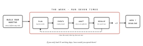

# Overview

**Level 0** of the game's [reading order](../README.md#reading-order) - the back-of-box pitch.
If you read nothing else, read this page.

## What is this?

**High-Performance Team** is a cooperative strategy game for **3-6 players**, about 60-90
minutes. A team has **35 working days** to deliver a project - and along the way, they either
become a real high-performing team, or they don't.

## The core fantasy

Every week you commit the team's five days - build, plan, coordinate, align, teach, demo,
reflect, celebrate, or sit through a meeting - **before you find out what's coming.** Then
reality lands on the plan you already made. Each character's habitus turns the same choice
into different behaviour.

## How a game actually goes

1. **Build your habitus.** Every player is dealt five parts - Base, Legs, Torso, Head, Item -
   and physically builds their character before a single project rule is explained.
2. **Run the week, seven times.** Lay five Activity cards → draw the Events → adapt what you
   still can, if you can afford to → resolve the week. See the diagram above.
3. **Week 7 is the deadline.** Whatever isn't banked by then doesn't count.

## Who this is for

Cooperative-strategy hobbyists first. It has to work as a good coop game before it works as
anything else - see the non-goal in [concept.md](./concept.md).

## What it's secretly about

Underneath the project-delivery fiction, the game is asking one question:

> "How do you turn a group of individuals into a real high-performing team before the deadline
> arrives?"

Nobody at the table needs to know that to enjoy it. **No component ever names a theorist.**
The thinking behind that question - and the eight thinkers it draws on - is
[Level 4, Designer's Notes](./04-designers-notes.md), and it's optional reading forever.

## Where to go next

Ready to actually sit down and play? Go to **Level 1 - [Learn to Play](./01-learn-to-play.md)**.
Want the full pitch, the design goals, and the skill curve this game is tuned to? See
[concept.md](./concept.md).
